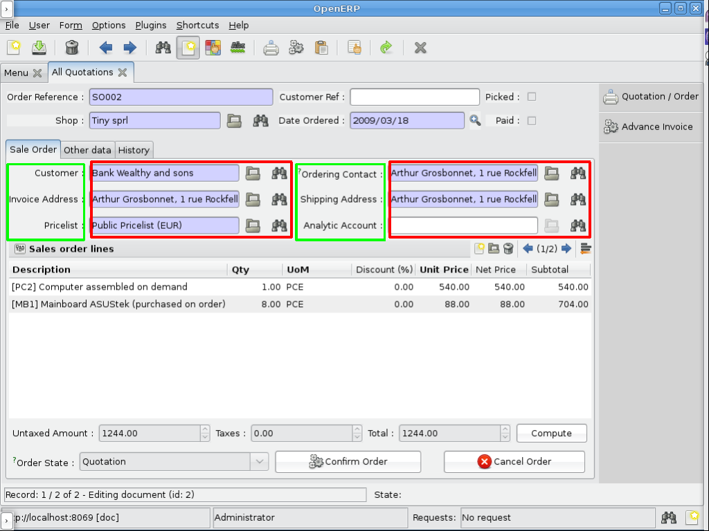
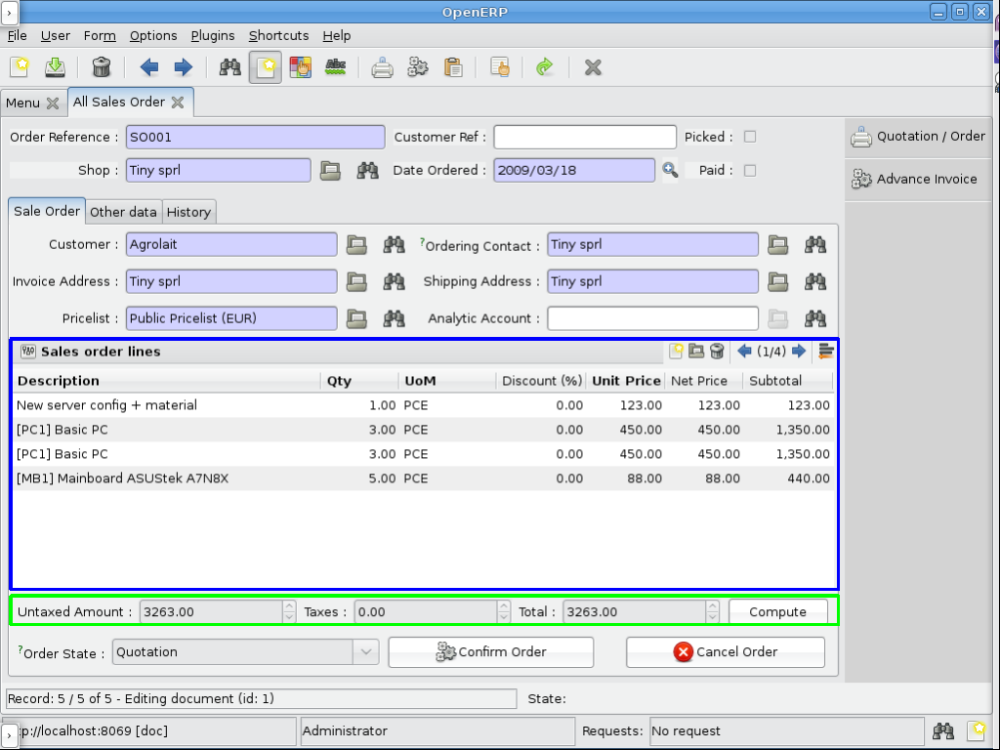
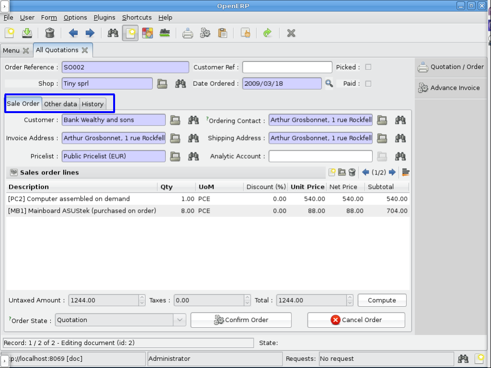
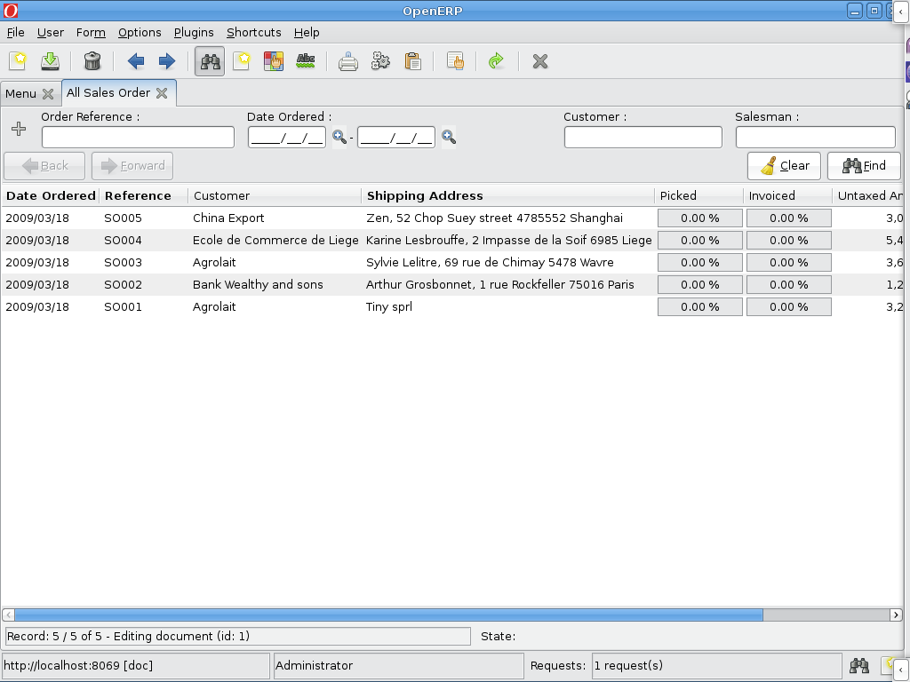
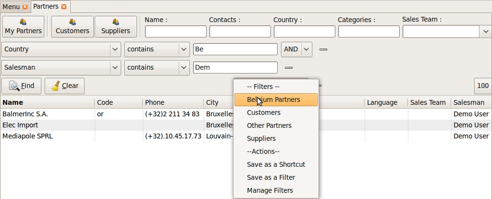
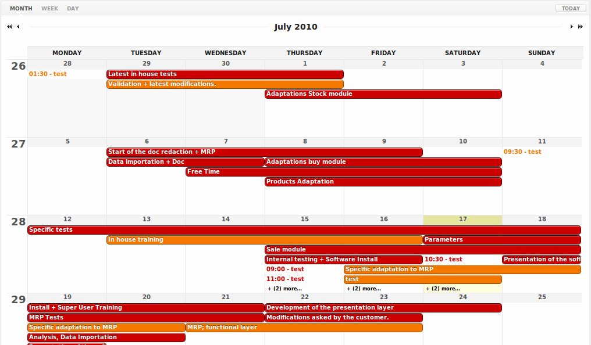
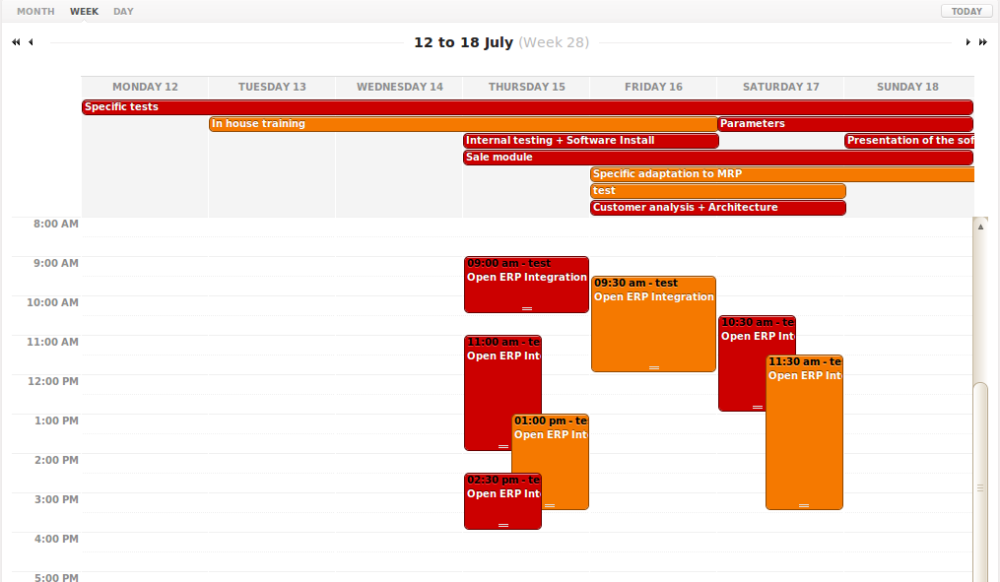
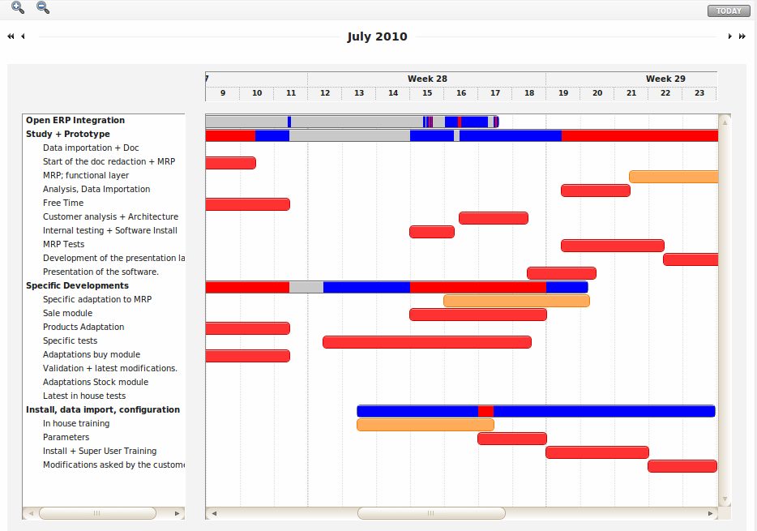
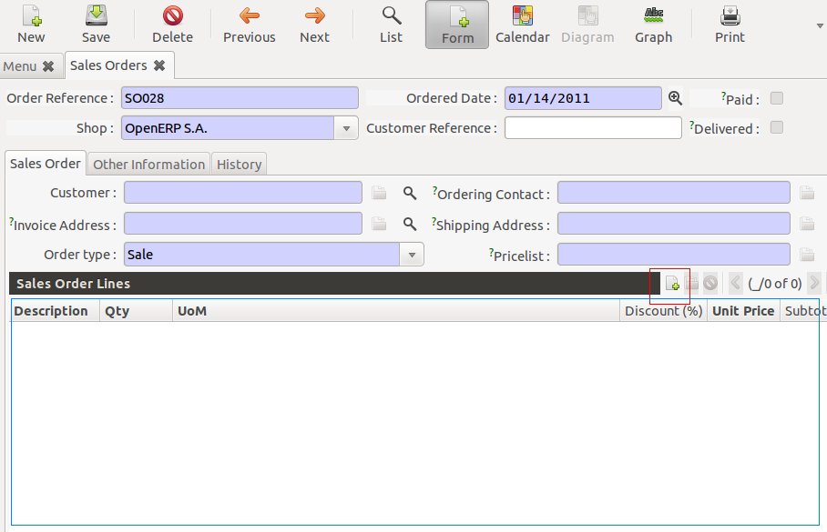

Views and Events
================

Introduction to Views
---------------------

As all program data is stored in objects, as explained in the Objects section, how are these objects exposed to the user ? We will try to answer this question in this section.

First of all, let's note that every resource type uses its own interface. For example, the screen to modify a partner's data is not the same as the one to modify an invoice.

Then, you should know that the OpenERP user interface is dynamic, which means it is not described "statically" by some code, but is dynamically built from XML descriptions of the client screens.

From now on, we will call these screen descriptions views.

A notable characteristic of these views is that they can be edited at any time (even during program execution). After modifying a displayed view you simply need to close the tab corresponding to that 'view' and re-open it for the changes to appear.

### Views principles

Views describe how each object (type of resource) is displayed. More precisely, for each object, we can define one (or several) view(s) to describe which fields should be drawn and how.

There are two types of views:

1.  form views
2.  tree views

Form views
----------

The field disposition in a form view always follows the same principle. Fields are distributed on the screen following the rules below:

-   By default, each field is preceded by a label, with its name.
-   Fields are placed on the screen from left to right, and from top to bottom, according to the order in which they are declared in the view.
-   Every screen is divided into 4 columns, each column being able to contain either a label, or an "edition" field. As every edition field is preceded (by default) by a label with its name, there will be two fields (and their respective labels) on each line of the screen. The green and red zones on the screen-shot below illustrate those 4 columns. They designate respectively the labels and their corresponding fields.



Views also support more advanced placement options:

-   A view field can use several columns. For example, on the screen-shot below, the zone in the blue frame is, in fact, the only field of a "one to many". We will come back later on this note, but let's note that it uses the whole width of the screen and not only one column.



    > scale:   50
    > align:   center

-   We can also make the opposite operation: take a columns group and divide it in as many columns as desired. The surrounded green zones of the screen above are good examples. Precisely, the green framework up and on the right side takes the place of two columns, but contains 4 columns.

As we can see below in the purple zone of the screen, there is also a way to distribute the fields of an object on different tabs.



Tree views
----------

These views are used when we work in list mode (in order to visualise several resources at once) and in the search screen. These views are simpler than the form views and thus have less options.



Graph views
-----------

A graph is a new mode of view for all views of type form. If, for example, a sale order line must be visible as list or as graph, define it like this in the action that opens this sale order line. Do not set the view mode as "tree,form,graph" or "form,graph" - it must be "graph,tree" to show the graph first or "tree,graph" to show the list first. (This view mode is extra to your "form,tree" view and should have a separate menu item):

```xml
<field name="view_type">form</field>
<field name="view_mode">tree,graph</field>
```

view\_type:

* tree = (tree with shortcuts at the left)
* form = (switchable view form/list) 

view\_mode:

* tree,graph : sequences of the views when switching

Then, the user will be able to switch from one view to the other. Unlike forms and trees, OpenERP is not able to automatically create a view on demand for the graph type. So, you must define a view for this graph:

```xml
<record model="ir.ui.view" id="view_order_line_graph">
   <field name="name">sale.order.line.graph</field>
   <field name="model">sale.order.line</field>
   <field name="type">graph</field>
   <field name="arch" type="xml">
     <graph string="Sales Order Lines">
          <field name="product_id" group="True"/>
          <field name="price_unit" operator="*"/>
    </graph>
    </field>
</record>
```

The graph view

A view of type graph is just a list of fields for the graph.

### Graph tag

The default type of the graph is a pie chart - to change it to a barchart change **&lt;graph string="Sales Order Lines"&gt;** to **&lt;graph string="Sales Order Lines" type="bar"&gt;** You also may change the orientation.

Example:

```xml
<graph string="Sales Order Lines" orientation="horizontal" type="bar">
```

### Field tag

The first field is the X axis. The second one is the Y axis and the optional third one is the Z axis for 3 dimensional graphs. You can apply a few attributes to each field/axis:

-   **group**: if set to true, the client will group all item of the same value for this field. For every other field, it will apply an operator
-   **operator**: the operator to apply if another field is grouped. By default it is '+'. Allowed values are:

    > -   +: addition
    > -   \*: multiply
    > -   \*\*: exponent
    > -   min: minimum of the list
    > -   max: maximum of the list

Defining real statistics on objects:

The easiest method to compute real statistics on objects is:

1.  Define a statistic object which is a postgresql view
2.  Create a tree view and a graph view on this object

You can get an example in all modules of the form: report\_.... Example: report\_crm.

Search views
------------

Search views are a new feature of OpenERP supported as of version 6.0. It creates a customized search panel, and is declared quite similarly to a form view, except that the view type and root element change to `search` instead of `form`.


Following is the list of new elements and features supported in search views.

### Group tag

Unlike form group elements, search view groups support unlimited number of widgets (fields or filters) in a row (no automatic line wrapping), and only use the following attributes:

-   `expand`: turns on the expander icon on the group (1 for expanded by default, 0 for collapsed)
-   `string`: label for the group

Example:

```xml
<group expand="1" string="Group By...">
   <filter string="Users" icon="terp-project" domain="[]" context="{'group_by':'user_id'}"/>
   <filter string="Project" icon="terp-project" domain="[]" context="{'group_by':'project_id'}"/>
   <separator orientation="vertical"/>
   <filter string="Deadline" icon="terp-project" domain="[]" context="{'group_by':'date_deadline'}"/>
</group>
```

In the screenshot above the green area is an expandable group.

### Filter tag

Filters are displayed as a toggle button on search panel Filter elements can add new values in the current domain or context of the search view. Filters can be added as a child element of field too, to indicate that they apply specifically to that field (in this case the button's icon will smaller)

In the picture above the red area contains filters at the top of the form while the blue area highlights a field and its child filter.

```xml
<filter string="Current" domain="[('state','in',('open','draft'))]" help="Draft, Open and Pending Tasks" icon="terp-project"/>
<field name="project_id" select="1" widget="selection">
    <filter domain="[('project_id.user_id','=',uid)]" help="My Projects" icon="terp-project"/>
</field>
```

### Group By

```xml
<filter string="Project" icon="terp-project" domain="[]" context="{'group_by':'project_id'}"/>
```

Above filters groups records sharing the same `project_id` value. Groups are loaded lazily, so the inner records are only loaded when the group is expanded. The group header lines contain the common values for all records in that group, and all numeric fields currently displayed in the view are replaced by the sum of the values in that group.

It is also possible to group on multiple values by specifying a list of fields instead of a single string. In this case nested groups will be displayed:

```xml
<filter string="Project" icon="terp-project" domain="[]" context="{'group_by': ['project_id', 'user_id'] }"/>
```

### Fields

Field elements in search views are used to get user-provided values for searches. As a result, as for group elements, they are quite different than form view's fields:

-   a search field can contain filters, which generally indicate that both field and filter manage the same field and are related.

    Those inner filters are rendered as smaller buttons, right next to the field, and *must not* have a `string` attribute.

-   a search field really builds a domain composed of `[(field_name, operator, field_value)]`. This domain can be overridden in two ways:
    -   `@operator` replaces the default operator for the field (which depends on its type)
    -   `@filter_domain` lets you provide a fully custom domain, which will replace the default domain creation
-   a search field does not create a context by default, but you can provide an `@context` which will be evaluated and merged into the wider context (as with a `filter` element).

To get the value of the field in your `@context` or `@filter_domain`, you can use the variable `self`:

```xml
<field name="location_id" string="Location"
```

or

```xml
<field name="journal_id" widget="selection"
       context="{'journal_id':self, 'visible_id':self, 'normal_view':False}"/>
```

#### Range fields (date, datetime, time)

The range fields are composed of two input widgets (from and to) instead of just one.

This leads to peculiarities (compared to non-range search fields):

-   It is not possible to override the operator of a range field via `@operator`, as the domain is built of two sections and each section uses a different operator.
-   Instead of being a simple value (integer, string, float) `self` for use in `@filter_domain` and `@context` is a `dict`.

    Because each input widget of a range field can be empty (and the field itself will still be valid), care must be taken when using `self`: it has two string keys `"from"` and `"to"`, but any of these keys can be either missing entirely or set to the value `False`.

### Actions for Search view

After declaring a search view, it will be used automatically for all tree views on the same model. If several search views exist for a single model, the one with the highest priority (lowest sequence) will be used. Another option is to explicitly select the search view you want to use, by setting the `search_view_id` field of the action.

In addition to being able to pass default form values in the context of the action, OpenERP 6.0 now supports passing initial values for search views too, via the context. The context keys need to match the `search_default_XXX` format. `XXX` may refer to the `name` of a `<field>` or `<filter>` in the search view (as the `name` attribute is not required on filters, this only works for filters that have an explicit `name` set). The value should be either the initial value for search fields, or simply a boolean value for filters, to toggle them

```xml
<record id="action_view_task" model="ir.actions.act_window">
    <field name="name">Tasks</field>
    <field name="res_model">project.task</field>
    <field name="view_type">form</field>
    <field name="view_mode">tree,form,calendar,gantt,graph</field>
    <field eval="False" name="filter"/>
    <field name="view_id" ref="view_task_tree2"/>
    <field name="context">{"search_default_current":1,"search_default_user_id":uid}</field>
    <field name="search_view_id" ref="view_task_search_form"/>
</record>
```

### Custom Filters

As of v6.0, all search views feature custom search filters, as shown below. Users can define their own custom filters using any of the fields available on the current model, combining them with AND/OR operators. It is also possible to save any search context (the combination of all currently applied domain and context values) as a personal filter, which can be recalled at any time. Filters can also be turned into Shortcuts directly available in the User's homepage.



In above screenshot we filter Partner where Salesman = Demo user and Country = Belgium, We can save this search criteria as a Shortcut or save as Filter.

Filters are user specific and can be modified via the Manage Filters option in the filters drop-down.

Calendar Views
--------------

Calendar view provides timeline/schedule view for the data.

### View Specification

Here is an example view:

```xml
<calendar color="user_id" date_delay="planned_hours" date_start="date_start" string="Tasks">
    <field name="name"/>
    <field name="project_id"/>
</calendar>
```

Here is the list of supported attributes for `calendar` tag:

- `string` :   The title string for the view.
- `date_start`:   A `datetime` field to specify the starting date for the calendar item. This attribute is required.
- `date_stop`:   A `datetime` field to specify the end date. Ignored if `date_delay` attribute is specified.
- `date_delay`:   A `numeric` field to specify time in hours for a record. This attribute will get preference over `date_stop` and `date_stop` will be ignored.
- `day_length` :   An `integer` value to specify working day length. Default is `8` hours.
- `color`:   A field, generally `many2one`, to colourise calendar/gantt items.
- `mode`:   A string value to set default view/zoom mode. For `calendar` view, this can be one of following (default is `month`):
    -   `day`
    -   `week`
    -   `month`

### Screenshots

Month Calendar:



Week Calendar:



Gantt Views
-----------

Gantt view provides timeline view for the data. Generally, it can be used to display project tasks and resource allocation.

A Gantt chart is a graphical display of all the tasks that a project is composed of. Each bar on the chart is a graphical representation of the length of time the task is planned to take.

A resource allocation summary bar is shown on top of all the grouped tasks, representing how effectively the resources are allocated among the tasks.

Color coding of the summary bar is as follows:

-   Gray shows that the resource is not allocated to any task at that time
-   Blue shows that the resource is fully allocated at that time.
-   Red shows that the resource is overallocated

### View Specification

Here is an example view:

```xml
<gantt color="user_id" date_delay="planned_hours" date_start="date_start" string="Tasks">
    <level object="project.project" link="project_id" domain="[]">
        <field name="name"/>
    </level>
</gantt>
```

The `attributes` accepted by the `gantt` tag are similar to `calendar` view tag. The `level` tag is used to group the records by some `many2one` field. Currently, only one level is supported.

Here is the list of supported attributes for `gantt` tag:

- `string`:   The title string for the view.
 `date_start`:   A `datetime` field to specify the starting date for the gantt item. This attribute is required.
- `date_stop`:   A `datetime` field to specify the end date. Ignored if `date_delay` attribute is specified.
- `date_delay`:   A `numeric` field to specify time in hours for a record. This attribute will get preference over `date_stop` and `date_stop` will be ignored.
- `day_length`:   An `integer` value to specify working day length. Default is `8` hours.
- `color`:   A field, generally `many2one`, to colorize calendar/gantt items.
- `mode`:   A string value to set default view/zoom mode. For `gantt` view, this can be one of following (default is `month`):
    -   `day`
    -   `3days`
    -   `week`
    -   `3weeks`
    -   `month`
    -   `3months`
    -   `year`
    -   `3years`
    -   `5years`

The `level` tag supports following attributes:

- `object`:   An openerp object having many2one relationship with view object.
- `link`:   The field name in current object that links to the given `object`.
- `domain`:   The domain to be used to filter the given `object` records.

### Drag and Drop

The left side pane displays list of the tasks grouped by the given `level` field. You can reorder or change the group of any records by dragging them.

The main content pane displays horizontal bars plotted on a timeline grid. A group of bars are summarised with a top summary bar displaying resource allocation of all the underlying tasks.

You can change the task start time by dragging the tasks horizontally. While end time can be changed by dragging right end of a bar.

<div class="admonition note">

The time is calculated considering `day_length` so a bar will span more then one day if total time for a task is greater then `day_length` value.

</div>

### Screenshots



Design Elements
---------------

The files describing the views are of the form:

Example:

```xml
<?xml version="1.0"?>
<openerp>
   <data>
       [view definitions]
   </data>
</openerp>
```

The view definitions contain mainly three types of tags:

-   **&lt;record&gt;** tags with the attribute model="ir.ui.view", which contain the view definitions themselves
-   **&lt;record&gt;** tags with the attribute model="ir.actions.act\_window", which link actions to these views
-   **&lt;menuitem&gt;** tags, which create entries in the menu, and link them with actions

New : You can specify groups for whom the menu is accessible using the groups attribute in the menuitem tag.

New : You can now add shortcut using the shortcut tag.

Example:

```xml
<shortcut 
    name="Draft Purchase Order (Proposals)" 
    model="purchase.order" 
    logins="demo" 
    menu="m"/>
```

Note that you should add an id attribute on the menuitem which is referred by menu attribute.

```xml
<record model="ir.ui.view" id="v">
    <field name="name">sale.order.form</field>
    <field name="model">sale.order</field>
    <field name="priority" eval="2"/>
    <field name="arch" type="xml">
        <form string="Sale Order">
            .........
        </form>
    </field>
</record>
```

Default value for the priority field : 16. When not specified the system will use the view with the lower priority.

### View Types

#### Tree View

You can specify the columns to include in the list, along with some details of the list's appearance. The search fields aren't specified here, they're specified by the select attribute in the form view fields.

```xml
<record id="view_location_tree2" model="ir.ui.view">
    <field name="name">stock.location.tree</field>
    <field name="model">stock.location</field>
    <field name="type">tree</field>
    <field name="priority" eval="2"/>
    <field name="arch" type="xml">
        <tree 
            colors="blue:usage=='view';darkred:usage=='internal'">

            <field name="complete_name"/>
            <field name="usage"/>
            <field 
                name="stock_real" 
                invisible="'product_id' not in context"/>
            <field 
                name="stock_virtual" 
                invisible="'product_id' not in context"/>
        </tree>
    </field>
</record>
```

That example is just a flat list, but you can also display a real tree structure by specifying a field\_parent. The name is a bit misleading, though; the field you specify must contain a list of all **child** entries.

```xml
<record id="view_location_tree" model="ir.ui.view">
    <field name="name">stock.location.tree</field>
    <field name="model">stock.location</field>
    <field name="type">tree</field>
    <field name="field_parent">child_ids</field>
    <field name="arch" type="xml">
        <tree toolbar="1">
            <field icon="icon" name="name"/>
        </tree>
    </field>
</record>
```

On the tree element, the following attributes are supported:

- `colors`:   Conditions for applying different colours to items in the list. The default is black.
- `toolbar`:   Set this to 1 if you want a tree structure to list the top level entries in a separate toolbar area. When you click on an entry in the toolbar, all its descendants will be displayed in the main tree. The value is ignored for flat lists.

### Grouping Elements

#### Separator

Adds a separator line

Example:   

```xml
<separator string="Links" colspan="4"/>
```

The string attribute defines its label and the colspan attribute defines his horizontal size (in number of columns).

#### Notebook

&lt;notebook&gt;: With notebooks you can distribute the view fields on different tabs (each one defined by a page tag). You can use the tabpos properties to set tab at: up, down, left, right.

Example:   

```xml
<notebook colspan="4">....</notebook>
```

#### Group

&lt;group&gt;: groups several columns and split the group in as many columns as desired.

-   **colspan**: the number of columns to use
-   **rowspan**: the number of rows to use
-   **expand**: if we should expand the group or not
-   **col**: the number of columns to provide (to its children)
-   **string**: (optional) If set, a frame will be drawn around the group of fields, with a label containing the string. Otherwise, the frame will be invisible.

Example:   

```xml
<group col="3" colspan="2">
    <field name="invoiced" select="2"/>
    <button colspan="1" name="make_invoice" states="confirmed" string="Make Invoice"
        type="object"/>
</group>
```

#### Page

Defines a new notebook page for the view.

Example:   

```xml
<page string="Order Line"> ... </page>:
```

-   **string**: defines the name of the page.

### Data Elements

#### Field

attributes for the "field" tag

-   `select="1"`: mark this field as being one of the search criteria for this resource's search view. A value of 1 means that the field is included in the basic search, and a value of 2 means that it is in the advanced search.
-   `colspan="4"`: the number of columns on which a field must extend.
-   `readonly="1"`: set the widget as read only
-   `required="1"`: the field is marked as required. If a field is marked as required, a user has to fill it the system won't save the resource if the field is not filled. This attribute supersede the required field value defined in the object.
-   `nolabel="1"`: hides the label of the field (but the field is not hidden in the search view).
-   `invisible="True"`: hides both the label and the field.
-   `password="True"`: replace field values by asterisks, "\*".
-   `string=""`: change the field label. Note that this label is also used in the search view: see select attribute above).
-   `domain`: can restrict the domain. Example: `domain="\[('partner\_id','=',partner\_id)\]"`
-   `widget`: can change the widget.  Example: `widget="one2many\_list"`:
    -   one2one\_list
    -   one2many\_list
    -   many2one\_list
    -   many2many
    -   url
    -   email
    -   image
    -   float\_time
    -   reference
-   `mode`: sequences of the views when switching. Example: `mode="tree,graph"`
-   `on_change`: define a function that is called when the content of the field changes. Example: `on\_change="onchange\_partner(type,partner\_id)"` See the on change event &lt;onchange-event-link&gt; for details.
-   `attrs`: Permits to define attributes of a field depends on other fields of the same window. (It can be use on page, group, button and notebook tag also)
    -   Format: "{'attribute':\[('field\_name','operator','value'),('field\_name','operator','value')\],'attribute2':\[('field\_name','operator','value'),\]}"
    -   where attribute will be readonly, invisible, required
    -   Default value: {}.

Example: (in product.product)

```xml
<field digits="(14, 3)" name="volume" attrs="{'readonly':[('type','=','service')]}"/>
```

-   `eval`: evaluate the attribute content as if it was Python code (see below &lt;eval-attribute-link&gt; for example)
-   `default_focus`: set to `1` to put the focus (cursor position) on this field when the form is first opened. There can only be one field within a view having this attribute set to `1` **(new as of 5.2)**

Example:

```xml
<field name="name" default_focus=”1”/> 
```

Here's the source code of the view of a sale order object. This is the object shown on the screen shots of the presentation.

Example:

```xml
<?xml version="1.0"?>
<openerp>
    <data>
    <record id="view_partner_form" model="ir.ui.view">
            <field name="name">res.partner.form</field>
            <field name="model">res.partner</field>
            <field name="type">form</field>
            <field name="arch" type="xml">
            <form string="Partners">
                <group colspan="4" col="6">
                    <field name="name" select="1"/>
                    <field name="ref" select="1"/>
                    <field name="customer" select="1"/>
                    <field domain="[('domain', '=', 'partner')]" name="title"/>
                    <field name="lang" select="2"/>
                    <field name="supplier" select="2"/>
                </group>
                <notebook colspan="4">
                    <page string="General">
                        <field colspan="4" mode="form,tree" name="address"
                         nolabel="1" select="1">
                            <form string="Partner Contacts">
                                <field name="name" select="2"/>
                                <field domain="[('domain', '=', 'contact')]" name="title"/>
                                <field name="function"/>
                                <field name="type" select="2"/>
                                <field name="street" select="2"/>
                                <field name="street2"/>
                                <newline/>
                                <field name="zip" select="2"/>
                                <field name="city" select="2"/>
                                <newline/>
                                <field completion="1" name="country_id" select="2"/>
                                <field name="state_id" select="2"/>
                                <newline/>
                                <field name="phone"/>
                                <field name="fax"/>
                                <newline/>
                                <field name="mobile"/>
                                <field name="email" select="2" widget="email"/>
                            </form>
                            <tree string="Partner Contacts">
                                <field name="name"/>
                                <field name="zip"/>
                                <field name="city"/>
                                <field name="country_id"/>
                                <field name="phone"/>
                                <field name="email"/>
                            </tree>
                        </field>
                        <separator colspan="4" string="Categories"/>
                        <field colspan="4" name="category_id" nolabel="1" select="2"/>
                    </page>
                    <page string="Sales &amp; Purchases">
                        <separator string="General Information" colspan="4"/>
                        <field name="user_id" select="2"/>
                        <field name="active" select="2"/>
                        <field name="website" widget="url"/>
                        <field name="date" select="2"/>
                        <field name="parent_id"/>
                        <newline/>
                    </page>
                    <page string="History">
                        <field colspan="4" name="events" nolabel="1" widget="one2many_list"/>
                    </page>
                    <page string="Notes">
                        <field colspan="4" name="comment" nolabel="1"/>
                    </page>
                </notebook>
            </form>
            </field>
        </record>
    <menuitem
            action="action_partner_form"
            id="menu_partner_form"
            parent="base.menu_base_partner"
            sequence="2"/>
    </data>
</openerp>
```

##### The eval attribute

The **eval** attribute evaluates its content as if it was Python code. This allows you to define values that are not strings.

Normally, content inside *&lt;field&gt;* tags are always evaluated as strings.

```xml
<field name="value">2.3</field>
```

This will evaluate to the string `'2.3'` and not the float `2.3`

```xml
<field name="value">False</field>
```

This will evaluate to the string `'False'` and not the boolean `False`. This is especially tricky because Python's conversion rules consider any non-empty string to be `True`, so the above code will end up storing the opposite of what is desired.

If you want to evaluate the value to a float, a boolean or another type, except string, you need to use the **eval** attribute:

```xml
<field name="value" eval="2.3" />
<field name="value" eval="False" />
```

#### Button

Adds a button to the current view. Allows the user to perform various actions on the current record.

After a button has been clicked, the record should always be reloaded.

Buttons have the following attributes:

`type`:   Defines the type of action performed when the button is activated:

`workflow` (default):   The button will send a workflow signal[^1] on the current model using the `@name` of the button as workflow signal name and providing the record id as parameter (in a list).

The workflow signal may return an action descriptor &lt;window-action&gt;, which should be executed. Otherwise it will return `False`.

`object`:   The button will execute the method of name `@name` on the current model, providing the record id as parameter (in a list). This call may return an action descriptor &lt;window-action&gt;, which should be executed. Otherwise it will return `False`.

`action`:   The button will trigger the execution of an action (`ir.actions.actions`). The `id` of this action is the `@name` of the button.

From there, follows the normal action-execution workflow. One extra action type is to just close the window.

```python
return {'type': 'ir.actions.act_window_close'}
```

`special`:   Only has one possible value currently: `cancel`, which indicates that the popup should be closed without performing any RPC call or action resolution.

<div class="admonition note">
Only meaningful within a popup-type window (e.g. a wizard). Otherwise, is a noop.
</div>
<div class="admonition warning">
`special` and `type` are incompatible.
</div>

`name`:   The button's identifier, used to indicate which method should be called, which signal sent or which action executed.

`confirm`:   A confirmation popup to display before executing the button's task. If the confirmation is dismissed the button's task *must not* be executed.

`string`:   The label which should be displayed on the button[^2].

`icon`:   Display an icon on the button, if absent the button is text-only [^3].

`states`, `attrs`, `invisible`:   Standard OpenERP meaning for those view attributes

`default_focus`:   If set to a truthy value (`1`), automatically selects that button so it is used if `RETURN` is pressed while on the form. May be ignored by the client.

Example

```xml
<button name="order_confirm" states="draft" string="Confirm Order" icon="gtk-execute"/>
<button name="_action_open_window" string="Open Margins" type="object" default_focus=”1”/>
```

#### Label

Adds a simple label using the string attribute as caption.

Example:

```xml
<label string="Test"/>
```

#### New Line

Force a return to the line even if all the columns of the view are not filled in.

Example:

```xml
<newline/>
```

Inheritance in Views
--------------------

When you create and inherit objects in some custom or specific modules, it is better to inherit (than to replace) from an existing view to add/modify/delete some fields and preserve the others.

Example:

```xml
<record model="ir.ui.view" id="view_partner_form">
    <field name="name">res.partner.form.inherit</field>
    <field name="model">res.partner</field>
    <field name="inherit_id" ref="base.view_partner_form"/>
    <field name="arch" type="xml">
        <notebook position="inside">
            <page string="Relations">
                <field name="relation_ids" colspan="4" nolabel="1"/>
            </page>
        </notebook>
    </field>
</record>
```

This will add a page to the notebook of the `res.partner.form` view in the base module.

The inheritance engine will parse the existing view and search for the root nodes of

```xml
<field name="arch" type="xml">
```

It will append or edit the content of this tag. If this tag has some attributes, it will look in the parent view for a node with matching attributes (except position).

You can use these values in the position attribute:

-   inside (default): your values will be appended inside the tag
-   after: add the content after the tag
-   before: add the content before the tag
-   replace: replace the content of the tag.

### Replacing Content

```xml
<record model="ir.ui.view" id="view_partner_form1">
    <field name="name">res.partner.form.inherit1</field>
    <field name="model">res.partner</field>
    <field name="inherit_id" ref="base.view_partner_form"/>
    <field name="arch" type="xml">
        <page string="Extra Info" position="replace">
            <field name="relation_ids" colspan="4" nolabel="1"/>
        </page>
    </field>
</record>
```

Will replace the content of the Extra Info tab of the notebook with the `relation_ids` field.

The parent and the inherited views are correctly updated with `--update=all` argument like any other views.

### Deleting Content

To delete a field from a form, an empty element with `position="replace"` attribute is used. Example:

```xml
<record model="ir.ui.view" id="view_partner_form2">
    <field name="name">res.partner.form.inherit2</field>
    <field name="model">res.partner</field>
    <field name="inherit_id" ref="base.view_partner_form"/>
    <field name="arch" type="xml">
        <field name="lang" position="replace"/>
    </field>
</record>
```

### Inserting Content

To add a field into a form before the specified tag use `position="before"` attribute.

```xml
<record model="ir.ui.view" id="view_partner_form3">
    <field name="name">res.partner.form.inherit3</field>
    <field name="model">res.partner</field>
    <field name="inherit_id" ref="base.view_partner_form"/>
    <field name="arch" type="xml">
        <field name="lang" position="before">
            <field name="relation_ids"/>
        </field>
    </field>
</record>
```

Will add `relation_ids` field before the `lang` field.

To add a field into a form after the specified tag use `position="after"` attribute.

```xml
<record model="ir.ui.view" id="view_partner_form4">
    <field name="name">res.partner.form.inherit4</field>
    <field name="model">res.partner</field>
    <field name="inherit_id" ref="base.view_partner_form"/>
    <field name="arch" type="xml">
        <field name="lang" position="after">
            <field name="relation_ids"/>
        </field>
    </field>
</record>
```

Will add `relation_ids` field after the `lang` field.

### Multiple Changes

To make changes in more than one location, wrap the fields in a data element.

```xml
<record model="ir.ui.view" id="view_partner_form5">
    <field name="name">res.partner.form.inherit5</field>
    <field name="model">res.partner</field>
    <field name="inherit_id" ref="base.view_partner_form"/>
    <field name="arch" type="xml">
        <data>
            <field name="lang" position="replace"/>
            <field name="website" position="after">
                <field name="lang"/>
            </field>
        </data>
    </field>
</record>
```

Will delete the `lang` field from its usual location, and display it after the `website` field.

### XPath Element

Sometimes a view is too complicated to let you simply identify a target field by name. For example, the field might appear in two places. When that happens, you can use an `xpath` element to describe where your changes should be placed.

```xml
<record model="ir.ui.view" id="view_partner_form6">
    <field name="name">res.partner.form.inherit6</field>
    <field name="model">res.partner</field>
    <field name="inherit_id" ref="base.view_partner_form"/>
    <field name="arch" type="xml">
        <data>
            <xpath 
                expr="//field[@name='address']/form/field[@name='email']"
                position="after">
                <field name="age"/>
            </xpath>
            <xpath 
                expr="//field[@name='address']/tree/field[@name='email']"
                position="after">
                <field name="age"/>
            </xpath>
        </data>
    </field>
</record>
```

Will add the `age` field after the `email` field in both the form and tree view of the address list.

### Replacing Attributes

The `attributes` position lets you change an element's attributes without completely replacing it and its children. A common example is changing the colours in a tree view.

```xml
<record id="mrp_production_tree_view" model="ir.ui.view">
  <field name="name">mrp.production.mycompany.tree.view</field>
  <field name="model">mrp.production</field>
  <field name="type">tree</field>
  <field name="inherit_id" ref="mrp.mrp_production_tree_view"/>
  <field name="arch" type="xml">
    <xpath expr="//tree" position="attributes">
      <attribute name="colors">blue:state=='draft'</attribute>
    </xpath>
  </field>
</record>
```

Specify the views you want to use
---------------------------------

There are some cases where you would like to specify a view other than the default:

-   If there are several form or tree views for an object.
-   If you want to change the form or tree view used by a relational field (one2many for example).

### Using the priority field

This field is available in the view definition, and is 16 by default. By default, OpenERP will display a model using the view with the highest priority (the smallest number). For example, imagine we have two views for a simple model. The model *client* with two fields : **firstname** and **lastname**. We will define two views, one which shows the firstname first, and the other one which shows the lastname first.

```xml
<!--
    Here is the first view for the model 'client'.
    We don't specify a priority field, which means 
    by default 16.
-->
<record model="ir.ui.view" id="client_form_view_1">
    <field name="name">client.form.view1</field>
    <field name="model">client</field>
    <field name="type">form</fiel>
    <field name="arch" type="xml">
        <field name="firstname"/>
        <field name="lastname"/>
    </field>
</record>

<!--
    A second view, which show fields in an other order.
    We specify a priority of 15.
-->
<record model="ir.ui.view" id="client_form_view_2">
    <field name="name">client.form.view2</field>
    <field name="model">client</field>
    <field name="priority" eval="15"/>
    <field name="type">form</fiel>
    <field name="arch" type="xml">
        <field name="lastname"/>
        <field name="firstname"/>
    </field>
</record>
```

Now, each time OpenERP will have to show a form view for our object *client*, it will have the choice between two views. **It will always use the second one, because it has a higher priority !** Unless you tell it to use the first one !

### Specify per-action view

To illustrate this point, we will create 2 menus which show a form view for this *client* object :

```xml
<!--
    This action open the default view (in our case,
    the view with the highest priority, the second one)
-->
<record 
    model="ir.actions.act_window" 
    id="client_form_action">
    <field name="name">client.form.action</field>
    <field name="res_model">client</field>
    <field name="view_type">form</field>
    <field name="view_mode">form</field>
</record>

<!--
    This action open the view we specify.
-->
<record 
    model="ir.actions.act_window" 
    id="client_form_action1">
    <field name="name">client.form.action1</field>
    <field name="res_model">client</field>
    <field name="view_type">form</field>
    <field name="view_mode">form</field>
    <field name="view_id" ref="client_form_view_1"/>
</record>

<menuitem id="menu_id" name="Client main menu"/>
<menuitem 
    id="menu_id_1" 
    name="Here we don't specify the view"
    action="client_form_action" parent="menu_id"/>
<menuitem 
    id="menu_id_1" 
    name="Here we specify the view"
    action="client_form_action1" parent="menu_id"/>
```

As you can see on line *19*, we can specify a view. That means that when we open the second menu, OpenERP will use the form view *client\_form\_view\_1*, regardless of its priority.

<div class="admonition note">

Remember to use the module name (*module.view\_id*) in the *ref* attribute if you are referring to a view defined in another module.

</div>

### Specify views for related fields

#### Using the context

The *view\_id* method works very well for menus/actions, but how can you specify the view to use for a one2many field, for example? When you have a one2many field, two views are used, a tree view (**in blue**), and a form view when you click on the add button (**in red**).



When you add a one2many field in a form view, you do something like this :

```xml
<field name="order_line" colspan="4" nolabel="1"/>
```

If you want to specify the views to use, you can add a *context* attribute, and specify a view id for each type of view supported, exactly like the action's *view\_id* attribute:

```xml
<field name="order_line" colspan="4" nolabel="1"
       context="{'form_view_ref' : 'module.view_id', 'tree_view_ref' : 'module.view_id'}"/>
```           

If you don't specify the views, OpenERP will choose one in this order :

1.  It will use the &lt;form&gt; or &lt;tree&gt; view defined **inside** the field (see below)
2.  Else, it will use the views with the highest priority for this object.
3.  Finally, it will generate default empty views, with all fields.

<div class="admonition note">

The context keys are named &lt;view\_type&gt;\_view\_ref.

</div>

<div class="admonition note">

By default, OpenERP will never use a view that is not defined for your object. If you have two models, with the same fields, but a different model name, OpenERP will never use the view of one for the other, even if one model inherit an other.

You can force this by manually specifying the view, either in the action or in the context.

</div>

#### Using subviews

In the case of relational fields, you can create a view directly inside a field :

```xml
<record model="ir.ui.view" id="some_view">
    <field name="name">some.view</field>
    <field name="type">form</field>
    <field name="model">some.model.with.one2many</field>
    <field name="arch" type="xml">
        <field name="..."/>

        <!-- <=== order_line is a one2many field -->
        <field name="order_line" colspan="4" nolabel="1">
            <form>
                <field name="qty"/>
                ...
            </form>
            <tree>
                <field name="qty"/>
                ...
            </tree>
        </field>
</field>
```

If you or another developer want to inherit from this view in another module, you need to inherit from the parent view and then modify the child fields. With child views, you'll often need to use an xpath-element-inheritance to describe exactly where to place your new fields.

```xml
<record model="ir.ui.view" id="some_inherited_view">
    <field name="name">some.inherited.view</field>
    <field name="type">form</field>
    <field name="model">some.model.with.one2many</field>
    <field name="inherit_id" ref="core_module.some_view"/>
    <field name="arch" type="xml">
        <data>
            <xpath 
               expr="//field[@name='order_line']/form/field[@name='qty']"
               position="after">
               <field name="size"/>
            </xpath>
            <xpath 
               expr="//field[@name='order_line']/tree/field[@name='qty']"
               position="after">
               <field name="size"/>
            </xpath>
        </data>
</field>
```

One down side of defining a subview like this is that it can't be inherited on its own, it can only be inherited with the parent view. Your views will be more flexible if you define the child views separately and then specify which child view to use as part of the one2many field.

Events
------

### On Change

The on\_change attribute defines a method that is called when the content of a view field has changed.

This method takes at least arguments: cr, uid, ids, which are the three classical arguments and also the context dictionary. You can add parameters to the method. They must correspond to other fields defined in the view, and must also be defined in the XML with fields defined this way:

```xml
<field 
    name="name_of_field" 
    on_change="name_of_method(other_field_1, ..., other_field_n)"/> 
```

The example below is from the sale order view.

You can use the 'context' keyword to access data in the context that can be used as params of the function.:

```xml
<field name="shop_id" on_change="onchange_shop_id(shop_id)"/>
```

Python:

```python
def onchange_shop_id(self, cr, uid, ids, shop_id):
    v={} 
    if shop_id:
        shop=self.pool.get('sale.shop').browse(cr,uid,shop_id) 
        v['project_id']=shop.project_id.id 
        if shop.pricelist_id.id:
            v['pricelist_id']=shop.pricelist_id.id 
        v['payment_default_id']=shop.payment_default_id.id 
    return {'value':v} 
```

When editing the shop\_id form field, the onchange\_shop\_id method of the sale\_order object is called and returns a dictionary where the 'value' key contains a dictionary of the new value to use in the 'project\_id', 'pricelist\_id' and 'payment\_default\_id' fields.

Note that it is possible to change more than just the values of fields. For example, it is possible to change the value of some fields and the domain of other fields by returning a value of the form: return {'domain': d, 'value': value}

returns:   a dictionary with any mix of the following keys:

`domain`:   A mapping of `{field: domain}`.  The returned domains should be set on the fields instead of the default ones.

`value`:   A mapping of `{field: value}}`, the values will be set on the corresponding fields and may trigger new onchanges or attrs changes

`warning` A dict with the keys `title` and `message`. Both are mandatory. Indicate that an error message should be displayed to the user.

[^1]: via `exec_workflow` on the `object` rpc endpoint

[^2]: in form view, in list view buttons have no label

[^3]: behavior in list view is undefined, as list view buttons don't have labels.
