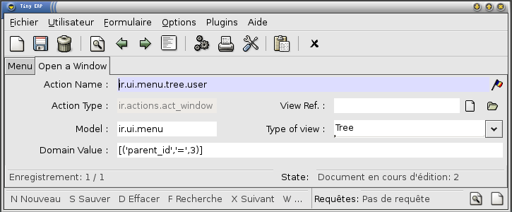
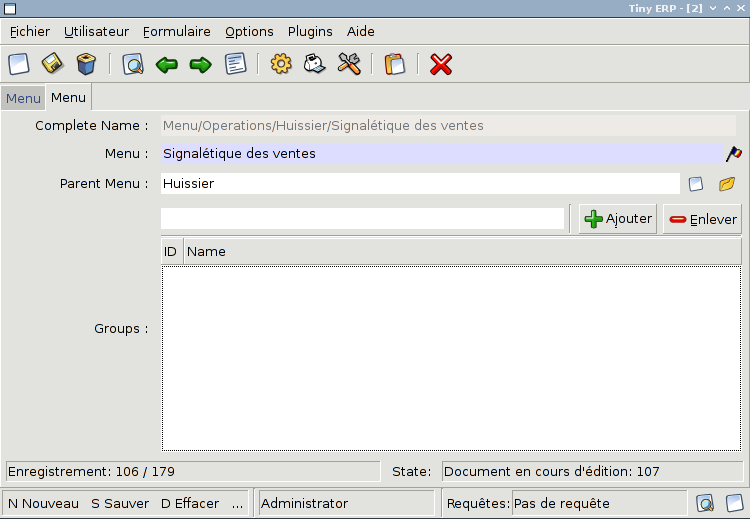

Menu and Actions
================

Menus
-----

Here's the template of a menu item : :

```xml
<menuitem id="menuitem_id" 
      name="Position/Of/The/Menu/Item/In/The/Tree" 
      action="action_id" 
      icon="NAME_FROM_LIST" 
      groups="groupname" 
      sequence="<integer>"/>
```

Where

-   **`id`**: specifies the identifier of the menu item in the menu items table. This identifier must be unique. Mandatory field.
-   **`name`** defines the position of the menu item in the menu hierarchy. Elements are separated by slashes ("/"). A menu item name with no slash in its text is a top level menu. Mandatory field.
-   action specifies the identifier of the action that must have been defined in the action table (ir.actions.act\_window). Note that this field is not mandatory : you can define menu elements without associating actions to them. This is useful when defining custom icons for menu elements that will act as folders (for example this is how custom icons for "Projects", "Human Resources" in OpenERP are defined).
- **`icon`** specifies which icon will be displayed for the menu item using the menu item. The default icon is STOCK\_OPEN.
-   The available icons are : STOCK\_ABOUT, STOCK\_ADD, STOCK\_APPLY, STOCK\_BOLD, STOCK\_CANCEL, STOCK\_CDROM, STOCK\_CLEAR, STOCK\_CLOSE, STOCK\_COLOR\_PICKER, STOCK\_CONNECT, STOCK\_CONVERT, STOCK\_COPY, STOCK\_CUT, STOCK\_DELETE, STOCK\_DIALOG\_AUTHENTICATION, STOCK\_DIALOG\_ERROR, STOCK\_DIALOG\_INFO, STOCK\_DIALOG\_QUESTION, STOCK\_DIALOG\_WARNING, STOCK\_DIRECTORY, STOCK\_DISCONNECT, STOCK\_DND, STOCK\_DND\_MULTIPLE, STOCK\_EDIT, STOCK\_EXECUTE, STOCK\_FILE, STOCK\_FIND, STOCK\_FIND\_AND\_REPLACE, STOCK\_FLOPPY, STOCK\_GOTO\_BOTTOM, STOCK\_GOTO\_FIRST, STOCK\_GOTO\_LAST, STOCK\_GOTO\_TOP, STOCK\_GO\_BACK, STOCK\_GO\_DOWN, STOCK\_GO\_FORWARD, STOCK\_GO\_UP, STOCK\_HARDDISK, STOCK\_HELP, STOCK\_HOME, STOCK\_INDENT, STOCK\_INDEX, STOCK\_ITALIC, STOCK\_JUMP\_TO, STOCK\_JUSTIFY\_CENTER, STOCK\_JUSTIFY\_FILL, STOCK\_JUSTIFY\_LEFT, STOCK\_JUSTIFY\_RIGHT, STOCK\_MEDIA\_FORWARD, STOCK\_MEDIA\_NEXT, STOCK\_MEDIA\_PAUSE, STOCK\_MEDIA\_PLAY, STOCK\_MEDIA\_PREVIOUS, STOCK\_MEDIA\_RECORD, STOCK\_MEDIA\_REWIND, STOCK\_MEDIA\_STOP, STOCK\_MISSING\_IMAGE, STOCK\_NETWORK, STOCK\_NEW, STOCK\_NO, STOCK\_OK, STOCK\_OPEN, STOCK\_PASTE, STOCK\_PREFERENCES, STOCK\_PRINT, STOCK\_PRINT\_PREVIEW, STOCK\_PROPERTIES, STOCK\_QUIT,STOCK\_REDO, STOCK\_REFRESH, STOCK\_REMOVE, STOCK\_REVERT\_TO\_SAVED, STOCK\_SAVE, STOCK\_SAVE\_AS, STOCK\_SELECT\_COLOR, STOCK\_SELECT\_FONT, STOCK\_SORT\_ASCENDING, STOCK\_SORT\_DESCENDING, STOCK\_SPELL\_CHECK, STOCK\_STOP, STOCK\_STRIKETHROUGH, STOCK\_UNDELETE, STOCK\_UNDERLINE, STOCK\_UNDO, STOCK\_UNINDENT, STOCK\_YES, STOCK\_ZOOM\_100, STOCK\_ZOOM\_FIT, STOCK\_ZOOM\_IN, STOCK\_ZOOM\_OUT, terp-account, terp-crm, terp-mrp, terp-product, terp-purchase, terp-sale, terp-tools, terp-administration, terp-hr, terp-partner, terp-project, terp-report, terp-stock

-   **`groups`** specifies which group of user can see the menu item (example : groups="admin"). See section " Management of Access Rights" for more information. Multiple groups should be separated by a ',' (example: groups="admin,user")
-   **`sequence`** is an integer that is used to sort the menu item in the menu. The higher the sequence number, the downer the menu item. This argument is not mandatory: if sequence is not specified, the menu item gets a default sequence number of 10. Menu items with the same sequence numbers are sorted by order of creation (*\_order =* "*sequence,id*").

### Example

In server/bin/addons/sale/sale\_view.xml, we have, for example :

```xml
<menuitem name="Sales Management/Sales Order/Sales Order in Progress" id="menu_action_order_tree4" action="action_order_tree4"/>
```

To change the icon of menu item:

* Highlight the menu with the icon you want to change.
* Select the "Switch to list/form" option from the "Form" menu. This will take you to the Menu editor.
* From here you can change the icon of the selected menu.

Actions
-------

### Introduction

The actions define the behavior of the system in response to the actions of the users ; login of a new user, double-click on an invoice, click on the action button, ...

There are different types of simple actions:

-   Window: Opening of a new window
-   Report: The printing of a report:   o Custom Report: The personalized reports o RML Report: The XSL:RML reports
-   Wizard: The beginning of a Wizard
-   Execute: The execution of a method on the server side
-   Group: Gather some actions in one group

The actions are used for the following events;

-   User connection,
-   The user double-clicks on the menu,
-   The user clicks on the icon 'print' or 'action'.

### Example of events

In OpenERP, all the actions are described and not configured. Two examples:

-   Opening of a window when double-clicking in the menu
-   User connection

#### Opening of the menu

When the user open the option of the menu "Operations &gt; Partners &gt; Partners Contact", the next steps are done to give the user information on the action to undertake.

1.  Search the action in the IR.
2.  Execution of the action
    1.  If the action is the type Opening the Window; it indicates to the user that a new window must be opened for a selected object and it gives you the view (form or list) and the filed to use (only the pro-forma invoice).
    2.  The user asks the object and receives information necessary to trace a form; the fields description and the XML view.

#### User connection

When a new user is connected to the server, the client must search the action to use for the first screen of this user. Generally, this action is: open the menu in the 'Operations' section.

The steps are:

1.  Reading of a user file to obtain ACTION\_ID
2.  Reading of the action and execution of this one

#### The fields

**Action Name**  :   The action name

**Action Type**  :   Always 'ir.actions.act\_window'

**View Ref**  :   The view used for showing the object

**Model**  :   The model of the object to post

**Type of View**  :   The type of view (Tree/Form)

**Domain Value**  :   The domain that decreases the visible data with this view

### The view

The view describes how the edition form or the data tree/list appear on screen. The views can be of 'Form' or 'Tree' type, according to whether they represent a form for the edition or a list/tree for global data viewing.

A form can be called by an action opening in 'Tree' mode. The form view is generally opened from the list mode (like if the user pushes on 'switch view').

### The domain

This parameter allows you to regulate which resources are visible in a selected view.(restriction)

For example, in the invoice case, you can define an action that opens a view that shows only invoices not paid.

The domains are written in python; list of tuples. The tuples have three elements;

-   the field on which the test must be done
-   the operator used for the test (&lt;, &gt;, =, like)
-   the tested value

For example, if you want to obtain only 'Draft' invoice, use the following domain; \[('state','=','draft')\]

In the case of a simple view, the domain define the resources which are the roots of the tree. The other resources, even if they are not from a part of the domain will be posted if the user develop the branches of the tree.

### Window Action

Actions are explained in more detail in the Client Action &lt;client-action&gt; section. Here's the template of an action XML record:

```xml
<record model="ir.actions.act_window" id="action_id_1">
    <field name="name">action.name</field>
    <field name="view_id" ref="view_id_1"/>
    <field name="domain">["list of 3-tuples (max 250 characters)"]</field>
    <field name="context">{"context dictionary (max 250 characters)"}</field>
    <field name="res_model">Open.object</field>
    <field name="view_type">form|tree</field>
    <field name="view_mode">form,tree|tree,form|form|tree</field>
    <field name="usage">menu</field>
    <field name="target">new</field>
</record>
```

**Where**

-   **id** is the identifier of the action in the table "ir.actions.act\_window". It must be unique.
-   **name** is the name of the action (mandatory).
-   **view\_id** is the name of the view to display when the action is activated. If this field is not defined, the view of a kind (list or form) associated to the object res\_model with the highest priority field is used (if two views have the same priority, the first defined view of a kind is used).
-   **domain** is a list of constraints used to refine the results of a selection, and hence to get less records displayed in the view. Constraints of the list are linked together with an AND clause : a record of the table will be displayed in the view only if all the constraints are satisfied.
-   **context** is the context dictionary which will be visible in the view that will be opened when the action is activated. Context dictionaries are declared with the same syntax as Python dictionaries in the XML file. For more information about context dictionaries, see section " The context Dictionary".
-   **res\_model** is the name of the object on which the action operates.
-   **view\_type** is set to form when the action must open a new form view, and is set to tree when the action must open a new tree view.
-   

    **view\_mode** is only considered if view\_type is form, and ignored otherwise. The four possibilities are :

    :   -   **form,tree** : the view is first displayed as a form, the list view can be displayed by clicking the "alternate view button" ;
        -   **tree,form** : the view is first displayed as a list, the form view can be displayed by clicking the "alternate view button" ;
        -   **form** : the view is displayed as a form and there is no way to switch to list view ;
        -   **tree** : the view is displayed as a list and there is no way to switch to form view.

(version 5 introduced **graph** and **calendar** views)

-   **usage** is used \[+ ***TODO*** +\]
-   **target** the view will open in new window like wizard.
-   **context** will be passed to the action itself and added to its global context

```xml
<record model="ir.actions.act_window" id="a">
    <field name="name">account.account.tree1</field> 
    <field name="res_model">account.account</field> 
    <field name="view_type">tree</field> 
    <field name="view_mode">form,tree</field> 
    <field name="view_id" ref="v"/> 
    <field name="domain">[('code','=','0')]</field> 
    <field name="context">{'project_id': active_id}</field> 
</record>
```

They indicate at the user that he has to open a new window in a new 'tab'.

Administration &gt; Custom &gt; Low Level &gt; Base &gt; Action &gt; Window Actions



#### Examples of actions

This action is declared in server/bin/addons/project/project\_view.xml. :

```xml
<record model="ir.actions.act_window" id="open_view_my_project">
    <field name="name">project.project</field>
    <field name="res_model">project.project</field>
    <field name="view_type">tree</field>
    <field name="domain">[('parent_id','=',False), ('manager', '=', uid)]</field>
    <field name="view_id" ref="view_my_project" />
</record>
```

This action is declared in server/bin/addons/stock/stock\_view.xml. :

```xml
<record model="ir.actions.act_window" id="action_picking_form">
    <field name="name">stock.picking</field>
    <field name="res_model">stock.picking</field>
    <field name="type">ir.actions.act_window</field>
    <field name="view_type">form</field>
    <field name="view_id" ref="view_picking_form"/>
    <field name="context">{'contact_display': 'partner'}</field>
</record>
```

### Url Action

### Wizard Action

Here's an example of a .XML file that declares a wizard. :

```xml
<?xml version="1.0"?>
<openerp>
    <data>
     <wizard string="Employee Info"
             model="hr.employee"
             name="employee.info.wizard"
             id="wizard_employee_info"/>
    </data>
</openerp>
```

A wizard is declared using a wizard tag. See "Add A New Wizard" for more information about wizard XML.

also you can add wizard in menu using following xml entry :

```xml
<?xml version="1.0"?>
<openerp>
     <data>
     <wizard string="Employee Info"
             model="hr.employee"
             name="employee.info.wizard"
             id="wizard_employee_info"/>
     <menuitem
             name="Human Resource/Employee Info"
             action="wizard_employee_info"
             type="wizard"
             id="menu_wizard_employee_info"/>
     </data>
</openerp>
```

### Report Action

#### Report declaration

Reports in OpenERP are explained in chapter "Reports Reporting". Here's an example of a XML file that declares a RML report : :

```xml
<?xml version="1.0"?>
<openerp>
    <data>
    <report id="sale_category_print"
            string="Sales Orders By Categories"
            model="sale.order"
            name="sale_category.print"
            rml="sale_category/report/sale_category_report.rml"
            menu="True"
            auto="False"/>
     </data>
</openerp>
```

A report is declared using a **report tag** inside a "data" block. The different arguments of a report tag are :

-   **id** : an identifier which must be unique.
-   **string** : the text of the menu that calls the report (if any, see below).
-   **model** : the OpenERP object on which the report will be rendered.
-   **rml** : the .RML report model. Important Note : Path is relative to addons/ directory.
-   **menu** : whether the report will be able to be called directly via the client or not. Setting menu to False is useful in case of reports called by wizards.
-   **auto** : determines if the .RML file must be parsed using the default parser or not. Using a custom parser allows you to define additional functions to your report.

Security
--------

Three concepts are differentiated into OpenERP;

1.  The users: person identified by his login/password
2.  The groups: define the access rights of the resources
3.  The roles: determine the roles/duties of the users


**The users**

They represent physical persons. These are identified with a login and a password. A user may belong to several groups and may have several roles.

A user must have an action set up. This action is executed when the user connects to the program with his login and password. An example of action would be to open the menu at 'Operations'.

The preferences of the user are available with the preference icon. You can, for example, through these preferences, determine the working language of this user. English is set by default.

A user can modify his own preferences while he is working with OpenERP. To do that, he clicks on this menu: User &gt; Preferences. The OpenERP administrator can also modify some preferences of each and every user.

**The groups**

The groups determine the access rights to the different resources. There are three types of right:

-   The writing access: recording & creation,
-   The reading access: reading of a file,
-   The execution access: the buttons of workflows or wizards.

A user can belong to several groups. If he belongs to several groups, we always use the group with the highest rights for a selected resource.

**The roles**

The roles define a hierarchical structure in tree. They represent the different jobs/roles inside the company. The biggest role has automatically the rights of all the inferior roles.

**Example:**

CEO

-   Technical manager
    -   Chief of projects
        -   Developers
        -   Testers
-   Commercial manager
    -   Salesmen
    -   ...

If we want to validate the test of a program (=role Testers), it may be done by a user having one of the following roles: Testers, Chief of the project, Technical manager, CEO.

The roles are used for the transition of Workflow actions into confirmation, choice or validation actions. Their implications will be detailed in the Workflow section.

### Menu Access

It's easy (but risky) to grant grained access to menu based on the user's groups.

First of all, you should know that if a menu is not granted to any group then it is accessible to everybody ! If you want to grant access to some groups just go to **Menu &gt; Administration &gt; Security &gt; Define access to Menu-items** and select the groups that can use this menu item.



Beware ! If the Administrator does not belong to one of the group, he will not be able to reach this menu again.
