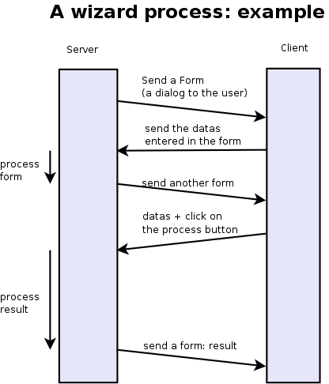
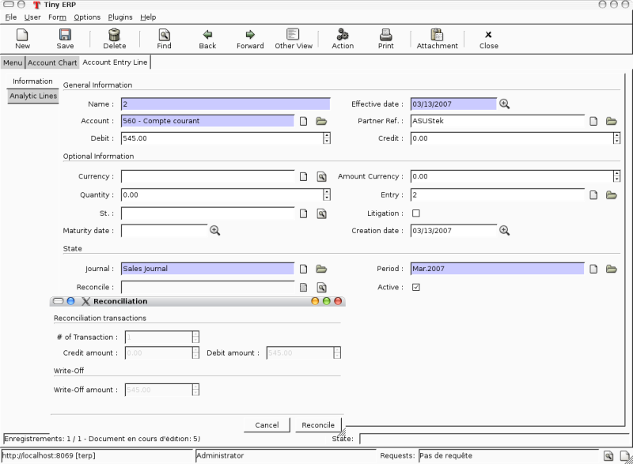
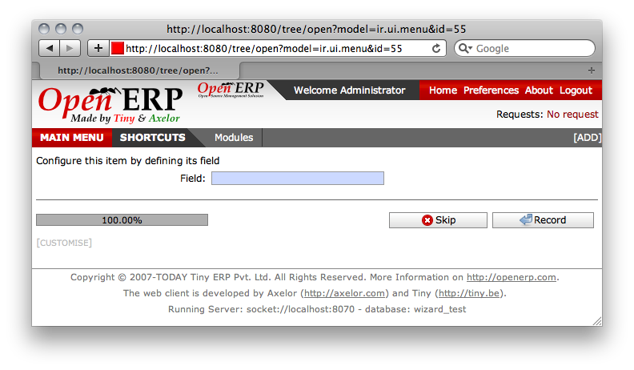
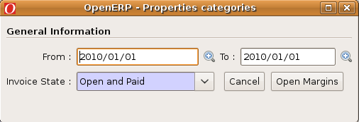
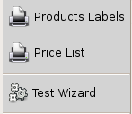

Creating Wizard - (The Process)
===============================

Introduction
------------

Wizards describe interaction sequences between the client and the server.

Here is, as an example, a typical process for a wizard:

> 1.  A window is sent to the client (a form to be completed)
> 2.  The client sends back the data from the fields which were filled in
> 3.  The server gets the result, usually execute a function and possibly sends another window/form to the client



Here is a screenshot of the wizard used to reconcile transactions (when you click on the gear icon in an account chart):

{width="100%"}

Wizards - Principles
--------------------

A wizard is a succession of steps. A step is composed of several actions;

1.  send a form to the client and some buttons
2.  get the form result and the button pressed from the client
3.  execute some actions
4.  send a new action to the client (form, print, ...)

To define a wizard, you have to create a class inheriting from **wizard.interface** and instantiate it. Each wizard must have a unique name, which can be chosen arbitrarily except for the fact it has to start with the module name (for example: account.move.line.reconcile). The wizard must define a dictionary named **states** which defines all its steps. A full example of a simple wizard can be found at <http://www.openobject.com/forum/post43900.html#43900>

Here is an example of such a class:

```python
class wiz_reconcile(wizard.interface):
      states = {
       'init': {
            'actions': [_trans_rec_get],
            'result': {'type': 'form', 
                       'arch': _transaction_form, 
                       'fields': _transaction_fields,  
                       'state':[('reconcile','Reconcile'),('end','Cancel')]}
      },
       'reconcile': {
            'actions': [_trans_rec_reconcile],
            'result': {'type': 'state', 'state':'end'}
      }
     }
wiz_reconcile('account.move.line.reconcile');
```

The 'states' dictionary define all the states of the wizard. In this example; **init** and **reconcile**. There is another state which is named end which is implicit.

A wizard always starts in the **init** state and ends in the **end** state.

A state define two things:

1.  a list of actions
2.  a result

### The list of actions

Each step/state of a wizard defines a list of actions which are executed when the wizard enters the state. This list can be empty.

The function (actions) must have the following signatures:

```python
def _trans_rec_get(self, uid, data, res_get=False):
```

Where:

-   **self** is the pointer to the wizard object
-   **uid** is the user ID of the user which is executing the wizard
-   

    **data** is a dictionary containing the following data:

    -   **ids**: the list of ids of resources selected when the user executed the wizard
    -   **id**: the id highlighted when the user executed the wizard
    -   **form**: a dictionary containing all the values the user completed in the preceding forms. If you change values in this dictionary, the following forms will be pre-completed.

Each action function must return a dictionary. Any entries in this dictionary will be merged with the data that is passed to the form when it's displayed.

### The result

Here are some result examples:

Result: next step

```python
'result': {'type': 'state', 
           'state':'end'}
```

Indicate that the wizard has to continue to the next state: 'end'. If this is the 'end' state, the wizard stops.

Result: new dialog for the client

```python
'result': {'type': 'form', 
           'arch': _form, 
           'fields': _fields, 
           'state':[('reconcile','Reconcile'),('end','Cancel')]}
```

The type=form indicate that this step is a dialog to the client. The dialog is composed of:

1.  a form : with fields description and a form description
2.  some buttons : on which the user press after completing the form

The form description (arch) is like in the views objects. Here is an example of form:

```xml
_form = """<?xml version="1.0"?>
    <form title="Reconciliation">
      <separator string="Reconciliation transactions" colspan="4"/>
      <field name="trans_nbr"/>
      <newline/>
      <field name="credit"/>
      <field name="debit"/>
      <field name="state"/>
      <separator string="Write-Off" colspan="4"/>
      <field name="writeoff"/>
      <newline/>
      <field name="writeoff_acc_id" colspan="3"/>
    </form>
    """
```

The fields description is similar to the fields described in the python ORM objects. Example:

```python
_transaction_fields = {
      'trans_nbr': {'string':'# of Transaction', 'type':'integer', 'readonly':True},
      'credit': {'string':'Credit amount', 'type':'float', 'readonly':True},
      'debit': {'string':'Debit amount', 'type':'float', 'readonly':True},
      'state': { 
            'string':"Date/Period Filter", 
            'type':'selection', 
            'selection':[('bydate','By Date'),
                     ('byperiod','By Period'),
                     ('all','By Date and Period'),
                     ('none','No Filter')], 
            'default': lambda *a:'none' 
            }, 
      'writeoff': {'string':'Write-Off amount', 'type':'float', 'readonly':True},
      'writeoff_acc_id': {'string':'Write-Off account', 
                               'type':'many2one', 
                               'relation':'account.account'
                             },
}
```

Each step/state of a wizard can have several buttons. Those are located on the bottom right of the dialog box. The list of buttons for each step of the wizard is declared in the state key of its result dictionary.

For example:

```python
'state':[('end', 'Cancel', 'gtk-cancel'), ('reconcile', 'Reconcile', '', True)]
```

1.  the next step name (determine which state will be next)
2.  the button string (to display for the client)
3.  the gtk stock item without the stock prefix (since 4.2)
4.  a boolean, if true the button is set as the default action (since 4.2)

Here is a screenshot of this form:

{width="100%"}

Result: call a method to determine which state is next

```python
def _check_refund(self, cr, uid, data, context):
    ...
    return datas['form']['refund_id'] and 'wait_invoice' or 'end'

    ...

    'result': {'type':'choice', 'next_state':_check_refund}
```

Result: print a report

```python
def _get_invoice_id(self, uid, datas):
      ...
      return {'ids': [...]}

      ...

      'actions': [_get_invoice_id],
      'result': {'type':'print', 
             'report':'account.invoice', 
             'get_id_from_action': True, 
             'state':'check_refund'}
```

Result: client run an action

```python
def _makeInvoices(self, cr, uid, data, context):
    ...
    return {
        'domain': "[('id','in', ["+','.join(map(str,newinv))+"])]",
        'name': 'Invoices',
        'view_type': 'form',
        'view_mode': 'tree,form',
        'res_model': 'account.invoice',
        'view_id': False,
        'context': "{'type':'out_refund'}",
        'type': 'ir.actions.act_window'
    }

    ...

    'result': {'type': 'action', 
    'action': _makeInvoices, 
    'state': 'end'}
```

The result of the function must be an all the fields of an ir.actions.\* Here it is an ir.action.act\_window, so the client will open an new tab for the objects account.invoice For more information about the fields used click here.

It is recommended to use the result of a read on the ir.actions object like this:

```python
def _account_chart_open_window(self, cr, uid, data, context):
    mod_obj = pooler.get_pool(cr.dbname).get('ir.model.data')
    act_obj = pooler.get_pool(cr.dbname).get('ir.actions.act_window')

    result = mod_obj._get_id(cr, uid, 'account', 'action_account_tree')
    id = mod_obj.read(cr, uid, [result], ['res_id'])[0]['res_id']
    result = act_obj.read(cr, uid, [id])[0]
    result['context'] = str({'fiscalyear': data['form']['fiscalyear']})
    return result

    ...

    'result': {'type': 'action', 
               'action': _account_chart_open_window, 
               'state':'end'}
```

Specification
-------------

### Form

```xml
_form = '''<?xml version="1.0"?>
<form string="Your String">
    <field name="Field 1"/>
    <newline/>
    <field name="Field 2"/>
</form>'''
```

### Fields

#### Standard

```python
Field type: char, integer, boolean, float, date, datetime

_fields = {
      'str_field': {'string':'product name', 'type':'char', 'readonly':True},
}
```

-   **string**: Field label (required)
-   **type**: (required)
-   **readonly**: (optional)

#### Relational

```python
Field type: one2one,many2one,one2many,many2many

_fields = {
    'field_id': {'string':'Write-Off account', 'type':'many2one', 'relation':'account.account'}
}
```

-   **string**: Field label (required)
-   **type**: (required)
-   **relation**: name of the relation object

#### Selection

```python
Field type: selection

_fields = {
    'field_id':  { 
         'string':"Date/Period Filter", 
         'type':'selection', 
         'selection':[('bydate','By Date'),
                  ('byperiod','By Period'),
                  ('all','By Date and Period'),
                  ('none','No Filter')], 
         'default': lambda *a:'none' 
         },
```

-   **string**: Field label (required)
-   **type**: (required)
-   **selection**: key and values for the selection field

Add A New Wizard
----------------

To create a new wizard, you must:

-   create the wizard definition in a .py file:
    -   wizards are usually defined in the wizard subdirectory of their module as in server/bin/addons/module\_name/wizard/your\_wizard\_name.py

-   add your wizard to the list of import statements in the \_\_init\_\_.py file of your module's wizard subdirectory.
-   declare your wizard in the database

The declaration is needed to map the wizard with a key of the client; when to launch which client. To declare a new wizard, you need to add it to the module\_name\_wizard.xml file, which contains all the wizard declarations for the module. If that file does not exist, you need to create it first.

Here is an example of the account\_wizard.xml file;

```xml
<?xml version="1.0"?>
<openerp>
    <data>
    <delete model="ir.actions.wizard" search="[('wiz_name','like','account.')]" />
    <wizard string="Reconcile Transactions" model="account.move.line" 
                    name="account.move.line.reconcile" />
    <wizard string="Verify Transac steptions" model="account.move.line" 
                    name="account.move.line.check" keyword="tree_but_action" /> 
    <wizard string="Verify Transactions" model="account.move.line"  
                    name="account.move.line.check" />
    <wizard string="Print Journal" model="account.account" 
                    name="account.journal" />
    <wizard string="Split Invoice" model="account.invoice" 
                    name="account.invoice.split" />
    <wizard string="Refund Invoice" model="account.invoice" 
                    name="account.invoice.refund" />
    </data>
</openerp>
```

Attributes for the wizard tag:

-   **id**: Unique identifier for this wizard.
-   **string**: The string which will be displayed if there are several wizards for one resource. (The user will be presented a list with the wizards' names).
-   **model**: The name of the **model** where the data needed by the wizard is.
-   **name**: The name of the wizard. It is used internally and should be unique.
-   **replace** (optional): Whether or not the wizard should override **all** existing wizards for this model. Default value: False.
-   **menu** (optional): Whether or not (True|False) to link the wizard with the 'gears' button (i.e. show the button or not). Default value: True.
-   

    **keyword** (optional): Bind the wizard to another action (print icon, gear icon, ...). Possible values for the keyword attribute are:

    :   -   **client\_print\_multi**: the print icon in a form
        -   **client\_action\_multi**: the 'gears' icon in a form
        -   **tree\_but\_action**: the 'gears' icon in a tree view (with the shortcuts on the left)
        -   **tree\_but\_open**: the double click on a branch of a tree (with the shortcuts on the left). For example, this is used, to bind wizards in the menu.

**\_\_openerp\_\_.py**

If the wizard you created is the first one of its module, you probably had to create the modulename\_wizard.xml file yourself. In that case, it should be added to the update\_xml field of the \_\_openerp\_\_.py file of the module.

Here is, for example, the **\_\_openerp\_\_.py** file for the account module.

```python
{
    "name": OpenERP Accounting",
    "version": "0.1",
    "depends": ["base"],
    "init_xml": ["account_workflow.xml", "account_data.xml"],
    "update_xml": ["account_view.xml","account_report.xml", "account_wizard.xml"],
}
```

osv\_memory Wizard System
-------------------------

To develop osv\_memory wizard, just create a normal object, But instead of inheriting from osv.osv, Inherit from osv.osv\_memory. Methods of "wizard" are in object and if the wizard is complex, You can define workflow on object. osv\_memory object is managed in memory instead of storing in postgresql.

That's all, nothing more than just changing the inherit. These wizards can be defined at any location unlike addons/modulename/modulename\_wizard.py. Historically, the \_wizard prefix is for actual (old-style) wizards, so there might be a connotation there, the "new-style" osv\_memory based "wizards" are perfectly normal objects (just used to emulate the old wizards, so they don't really match the old separations. Furthermore, osv\_memory based "wizards" tend to need more than one object (e.g. one osv\_memory object for each state of the original wizard) so the correspondence is not exactly 1:1.

So what makes them looks like 'old' wizards?

-   In the action that opens the object, you can put

```python
<field name="target">new</field>
```

It means the object will open in a new window instead of the current one.

> -   On a button, you can use &lt;button special="cancel" .../&gt; to close the window.

Example : In project.py file.

```python
class config_compute_remaining(osv.osv_memory):
    _name='config.compute.remaining'
    def _get_remaining(self,cr, uid, ctx):
    if 'active_id' in ctx:
        return self.pool.get('project.task').browse(cr,uid,ctx['active_id']).remaining_hours
    return False
    _columns = {
    'remaining_hours' : fields.float('Remaining Hours', digits=(16,2),),
        }
    _defaults = {
    'remaining_hours': _get_remaining
    }
    def compute_hours(self, cr, uid, ids, context=None):
    if 'active_id' in context:
        remaining_hrs=self.browse(cr,uid,ids)[0].remaining_hours
        self.pool.get('project.task').write(cr,uid,context['active_id'],
                                                     {'remaining_hours' : remaining_hrs})
    return {
            'type': 'ir.actions.act_window_close',
     }
config_compute_remaining()
```

-   View is same as normal view (Note buttons).

Example :

```xml
<record id="view_config_compute_remaining" model="ir.ui.view">
        <field name="name">Compute Remaining Hours </field>
        <field name="model">config.compute.remaining</field>
        <field name="type">form</field>
        <field name="arch" type="xml">
            <form string="Remaining Hours">
                <separator colspan="4" string="Change Remaining Hours"/>
                <newline/>
                <field name="remaining_hours" widget="float_time"/>
                <group col="4" colspan="4">
                    <button icon="gtk-cancel" special="cancel" string="Cancel"/>
                    <button icon="gtk-ok" name="compute_hours" string="Update" type="object"/>
                </group>
            </form>
        </field>
    </record>
```

-   Action is also same as normal action (don't forget to add target attribute)

Example :

```xml
<record id="action_config_compute_remaining" model="ir.actions.act_window">
    <field name="name">Compute Remaining Hours</field>
    <field name="type">ir.actions.act_window</field>
    <field name="res_model">config.compute.remaining</field>
    <field name="view_type">form</field>
    <field name="view_mode">form</field>
    <field name="target">new</field>
</record>
```

osv\_memory configuration item
------------------------------

Sometimes, your addon can't do with configurable defaults and needs upfront configuration settings to work correctly. In these cases, you want to provide a configuration wizard right after installation, and potentially one which can be re-run later if needed.

Up until 5.0, OpenERP had such a facility but it was hardly documented and a very manual, arduous process. A simpler, more straightforward solution has been implemented for those needs.

### The basic concepts

The new implementation provides a base behavior `osv_memory` object from which you need to inherit. This behavior handles the flow between the configuration items of the various extensions, and inheriting from it is therefore mandatory.

There is also an inheritable view which provides a basic canvas, through mechanisms which will be explained later it's highly customizable. It's therefore strongly suggested that you should inherit from that view from yours as well.

### Creating a basic configuration item

#### Your configuration model

First comes the creation of the configuration item itself. This is a normal `osv_memory` object with a few constraints:

-   it has to inherit from `res.config`, which provides the basic configuration behaviors as well as the base event handlers and extension points
-   it has to provide an `execute` method.[^1] This method will be called when validating the configuration form and contains the validation logic. It shouldn't return anything.

```python
class my_item_config(osv.osv_memory):
    _name = 'my.model.config'
    _inherit = 'res.config' # mandatory

    _columns = {
        'my_field': fields.char('Field', size=64, required=True),
    }

    def execute(self, cr, uid, ids, context=None):
        'do whatever configuration work you need here'
my_item_config()
```

#### Your configuration view

Then comes the configuration form. OpenERP provides a base view which you can inherit so you don't have to deal with creating buttons and handling the progress bar (which should be displayed at the bottom left of all initial configuration dialogs). It's very strongly recommended that you use this base view.

Simply add an `inherit_id` field to a regular `ir.ui.view` and set its value to `res_config_view_base`:

```xml
<record id="my_config_view_form" model="ir.ui.view">
    <field name="name">my.item.config.view</field>
    <!-- this is the model defined above -->
    <field name="model">my.model.config</field>
    <field name="type">form</field>
    <field name="inherit_id" ref="base.res_config_view_base"/>
    ...
</record>
```

While this could be used as-is, it would display an empty dialog with a progress bar and two buttons which isn't of much interest. `res_config_view_base` has a special group hook which you should replace with your own content like so:

```xml
<field name="arch" type="xml">
    <group string="res_config_contents" position="replace">
        <!-- your content should be inserted within this, the string
             attribute of the previous group is used to easily find
             it for replacement -->
        <label colspan="4" align="0.0" string="
            Configure this item by defining its field"/>
        <field colspan="2" name="my_field"/>
    </group>
</field>
```

#### Opening your window

The next step is to create the `act_window` which links to the configuration model and the view:

```xml
<record id="my_config_window" model="ir.actions.act_window">
    <field name="name">My config window</field>
    <field name="type">ir.actions.act_window</field>
    <field name="res_model">my.model.config</field>
    <field name="view_type">form</field>
    <field name="view_id" ref="my_config_view_form"/>
    <field name="view_mode">form</field>
    <field name="target">new</field>
</record>
```

Note that the `name` field of this `act_window` will be displayed when listing the various configuration items in the Config Wizard Steps submenu (in Administration &gt; Configuration &gt; Configuration Wizards).

#### Registering your action

Finally comes actually registering the configuration item with OpenERP. This is done with an `ir.actions.todo` object, which mandates a single `action_id` field referencing the `act_window` created previously:

```xml
<record id="my_config_step" model="ir.actions.todo">
    <field name="action_id" ref="my_config_window"/>
</record>
```

`ir.actions.todo` also has 3 optional fields:

`sequence` (default: `10`)  :   The order in which the different steps are to be executed, lowest first.

`active` (default: `True`)  :   An inactive step will not be executed on the next round of configuration.

`state` (default: `'open'`)  :   The current state for the configuration step, mostly used to register what happened during its execution. The possible values are `'open'`, `'done'`, `'skip'` and `'cancel'`.

The result at this point is the following:

{width="100%"}

### Customizing your configuration item

While your current knowledge is certainly enough to configure your addon, a bit of good customization can be the difference between a good user experience and a great user experience.

#### More extensive view customization

As you might have noticed from the previous screen shot, by default your configuration window doesn't have a *title*, which isn't a problem but doesn't look very good either.

Before setting a title, a small modification to the existing view is needed though: the existing `group` needs to be wrapped in a `data` element so it's possible to customize more than one item of the parent view:

```xml
<record id="my_config_view_form" model="ir.ui.view">
    <field name="name">my.item.config.view</field>
    <!-- this is the model defined above -->
    <field name="model">my.model.config</field>
    <field name="type">form</field>
    <field name="inherit_id">res_config_view_base</field>
    <field name="arch" type="xml">
        <data>
            <group string="res_config_contents" position="replace">
                <!-- your content should be inserted within this, the
                     string attribute of the previous group is used to
                     easily find it for replacement
                 -->
                 <label colspan="4" align="0.0" string="
                        Configure this item by defining its field
                 ">
                 <field colspan="2" name="my_field"/>
             </group>
         </data>
     </field>
</record>
```

Then it becomes possible to alter the `string` attribute of the original `form` by adding the following code within the `data` element (in this case, probably before `group`):

```xml
<!-- position=attributes is new and is used to alter the
     element's attributes, instead of its content -->
<form position="attributes">
    <!-- set the value of the 'string' attribute -->
    <attribute name="string">Set item field</attribute>
</form>
```

<div class="admonition warning">

Comments in view overload

At this point (December 2009) OpenERP cannot handle comments at the toplevel of the view element overload. When testing or reusing these examples, remember to strip out the comments or you will get runtime errors when testing the addon.

</div>

With this, the configuration form gets a nice title:

{width="100%"}

More interesting customizations might be to alter the buttons provided by `res_config_view_base` at the bottom of the dialog: remove a button (if the configuration action shouldn't be skipped), change the button labels, ...

Since no specific hooks are provided for these alterations, they require the use of xpath selectors (using the `xpath` element).

Removing the Skip button and changing the label of the Record button to Set, for instance, would be done by adding the following after the `group` element:

```xml
<!-- select the button 'action_skip' of the original template
     and replace it by nothing, removing it -->
<xpath expr="//button[@name='action_skip']"
    position="replace"/>
```

```xml
<!-- select the button 'action_next' -->
<xpath expr="//button[@name='action_next']"
       position="attributes">
    <!-- and change the attribute 'string' to 'Set' -->
    <attribute name="string">Set</attribute>
</xpath>
```

and yield:

{width="100%"}

It is also possible to use this method to change the name of the button, and thus the method invoked on the object (though that isn't necessarily recommended).

#### Model customization

Though most of the requirements should be easy to fulfill using the provided `execute` method hook, some addon-specific requirements are a bit more complex. `res.config` should be able to provide all the hooks necessary for more complex behaviors.

##### Ignoring the next step

Ultimately, the switch to the next configuration item is done by calling the `self.next` method of `res.config`[^2]. This is the last thing the base implementations of `action_next` and `action_skip` do. But in some cases, looping on the current view or implementing a workflow-like behavior is needed. In these cases, you can simply return a dictionary from `execute`, and `res.config` will jump to that view instead of the one returned by `self.next`.

This is what the user creation item does, for instance, to let the user create several new users in a row.

##### Performing an action on skipping

As opposed to `action_next` which requires that `execute` be implemented by the children classes, `action_skip` comes fully implemented in `res.config`. But in the case where the child model needs to perform an action upon skipping discovery, it also provides a hook method called `cancel` which you can overload in a way similar to `execute`. Its behavior is identical to `execute`'s: not only is `next` called automatically at the end of `cancel` but it also gives the possibility of [ignoring the next step]().

##### Alternative actions

It's also possible to either overload `action_next` and `action_skip` or, more useful, to implement more actions than these two, if more than two buttons are needed for instance.

In this case, please remember that you should always provide a way to reach `self.next` to the user, in order for him to be able to configure the rest of his addons.

### `res.config`'s public API

All of the public API methods take the standard OpenERP set of arguments: `self`, `cr`, `uid`, `ids` and `context`.

#### `execute`

Hook method called in case the `action_next` button (default label: Record) is clicked. Should not return *anything* unless you want to display another view than the next configuration item. Returning anything other than a view dictionary will lead to undefined behaviors.

It is mandatory to overload it. Failure to do so will result in a `NotImplementedError` being raised at runtime.

The default `res.config` implementation should not be called in the overload (don't use `super`).

#### `cancel`

Hook method called in case the `action_skip` button (default label: Skip) is clicked. Its behavior is the same as [execute]()'s, except it's not mandatory to overload it.

#### `next`

Method called to fetch the todo (and the corresponding action) for the next configuration item. It can be overloaded if the configuration item needs custom behavior common to all events.

If overloaded, the default `res.config` implementation must be called and its result returned in order to get and execute the next configuration item.

#### `action_next` and `action_skip`

Event handler for the buttons of the base view, overloading them should never be necessary but in case it's needed the default `res.config` implementation should be called (via `super`) and its result returned.

Guidelines on how to convert old-style wizard to new osv\_memory style
----------------------------------------------------------------------

### OSV Memory Wizard

provide important advantages over the pre-5.0 wizard system, with support features that were difficult to implement in wizards previously, such as:

1.  inheritance
2.  workflows
3.  complex relation fields
4.  computed fields
5.  all kind of views (lists, graphs, ...)

The new wizards are also easier and more intuitive to write as they make use of the same syntax as other osv objects and views.

This section will highlight the main steps usually required when porting a classical wizard to the new osv\_memory wizard system. For more details about the osv\_memory wizard see also section XXX.

Basically the idea is to create a regular osv object to hold the data structures and the logic of the wizard, but instead of inheriting from osv.osv, you inherit from osv.osv\_memory. The methods of the old-style wizard will be moved as methods of the osv\_memory object, and the various views changed into real views defined on the model of the wizard.

If the wizard is complex, you could even define a workflow on the wizard object (see section XXX for details about workflows)

Using a very simple wizard as an example, here is a step-by-step conversion to the new osv\_memory system:

### Steps

1.  Create a new object that extends osv\_memory, including the required fields and methods:



```python
def _action_open_window(self, cr, uid, data, context): 
.
.

class product_margins(wizard.interface): 
    form1 = '''<?xml version="1.0"?> 
    <form string="View Stock of Products"> 
        <separator string="Select " colspan="4"/> 
        <field name="from_date"/> 
        <field name="to_date"/> 
        <field name="invoice_state"/> 
    </form>''' 

    form1_fields = { 
    'from_date': { 
                'string': 'From', 
                'type': 'date', 
                'default': lambda *a:time.strftime('%Y-01-01'), 

        }, 
    'to_date': { 
                'string': 'To', 
                'type': 'date', 
                'default': lambda *a:time.strftime('%Y-12-31'), 

        }, 
    'invoice_state': { 
                'string': 'Invoice State', 
                'type': 'selection', 
                'selection': [('paid','Paid'),('open_paid','Open and Paid'),('draft_open_paid','Draft, Open and Paid'),], 
                'required': True, 
                'default': lambda *a:"open_paid", 
        }, 
    } 

    states = { 
      'init': { 
            'actions': [], 
            'result': {'type': 'form', 'arch':form1, 'fields':form1_fields, 'state': [('end', 'Cancel','gtk-cancel'),('open', 'Open Margins','gtk-ok')]} 
        }, 
    'open': { 
            'actions': [], 
            'result': {'type': 'action', 'action': _action_open_window, 'state':'end'} 
        } 
    } 
product_margins('product.margins')
```

### New Wizard File : &lt;&lt;module\_name&gt;&gt;\_&lt;&lt;filename&gt;&gt;.py

```python
class product_margin(osv.osv_memory): 
    ''' 
    Product Margin 
    ''' 
    _name = 'product.margin' 
    _description = 'Product Margin' 

    def _action_open_window(self, cr, uid, ids, context): 
    . 
    . 
    . 

    _columns = { 
        #TODO : import time required to get correct date 
        'from_date': fields.date('From'), 
        #TODO : import time required to get correct date 
        'to_date': fields.date('To'), 
        'invoice_state':fields.selection([ 
           ('paid','Paid'), 
           ('open_paid','Open and Paid'), 
           ('draft_open_paid','Draft, Open and Paid'), 
        ],'Invoice State', select=True, required=True), 
    } 
    _defaults = { 
        'from_date':  lambda *a:time.strftime('%Y-01-01'), 
        'to_date': lambda *a:time.strftime('%Y-01-01'), 
        'invoice_state': lambda *a:"open_paid", 
    } 
product_margin()
```

Convert the views into real view records defined on the model of your wizard:

### Old Wizard File : wizard\_product\_margin.py

```python
form1 = '''<?xml version="1.0"?> 
<form string="View Stock of Products"> 
    <separator string="Select " colspan="4"/> 
    <field name="date"/> 
    <field name="invoice_state"/> 
</form>''' 
```

### New Wizard File : wizard/&lt;&lt;module\_name&gt;&gt;\_&lt;&lt;filename&gt;&gt;\_view.xml

```xml
<record id="product_margin_form_view" model="ir.ui.view"> 
    <field name="name">product.margin.form</field> 
    <field name="model">product.margin</field> 
    <field name="type">form</field> 
    <field name="arch" type="xml"> 
        <form string="Properties categories"> 
        <separator colspan="4" string="General Information"/> 
        <field name="from_date" /> 
        <field name="to_date" /> 
        <field name="invoice_state" /> 
        <group col="4" colspan="2"> 
                <button special="cancel" string="Cancel" type="object"/> 
                <button name="_action_open_window" string="Open Margins" type="object" default_focus=”1”/> 
        </group> 
        </form> 
    </field> 
</record> 
```

### Default\_focus attribute

```xml
<button name="_action_open_window" string="Open Margins" type="object" default_focus=”1”/> 
```

**default\_focus="1"** is a new attribute added in 5.2. While opening wizard default control will be on the widget having this attribute. There must be only one widget on a view having this attribute = 1 otherwise it will raise exception.

Note: For all states in the old wizard, we need to create buttons in new approach.

2.  To open the new wizard, you need to register an action that opens the first view on your wizard object. You will need to do the same for each view if your wizard contains several views. To make the view open in a pop-up window you can add a special target='new' field in the action:

```xml
<act_window name="Open Margin" 
    res_model="product.margin" 
    src_model="product.product" 
    view_mode="form" 
    target="new" 
    key2="client_action_multi"    
    id="product_margin_act_window"/>
```

key2="client\_action\_multi" : While using it in the act\_window, wizard will be added in the

1.  Action


2.  Sidebar



If key2 is omitted then it will be displayed only in sidebar.

Note: The "src\_model" attribute is only required if you want to put the wizard in the side bar of an object, you can leave it out, for example if you define an action to open the second view of a wizard.

3.  You can register this new action as a menuitem or in the context bar of any object by using a &lt;menuitem&gt; or &lt;act\_window&gt; record instead of the old &lt;wizard&gt; tag that can be removed:

### In Menu Item

To open a wizard view via a menuitem you can use the following syntax for the menu, using the XML id of the corresponding act\_window.

```xml
<menuitem id="main" name="OSV Memory Wizard Test"/>
<menuitem
        action="product_margin_act_window"
        id="menu_product_act"
        parent="main" />
```

4.  To open a wizard view via a button in another form you can use the following syntax for the button, using the XML id of the corresponding act\_window. This can be used to have multiple steps in your wizard:

```xml
<button name="%(product_margin.product_margin_act_window)d" 
        string="Test Wizard" type="action" states="draft"/>                     
```

5.  Finally, you need to cleanup the module, update the python \_\_init\_\_.py files if you have changed the python file name for the wizard, and add your new XML files in the update\_xml list in the \_\_openerp\_\_.py file.

[^1]: This isn't completely true, as you will see when [Customizing your configuration item]()

[^2]: this method is part of the official API and you're free to overload it if needed, but you should always call `res.config`'s through `super` when your work is done. Overloading `next` is also probably overkill in most situations.
