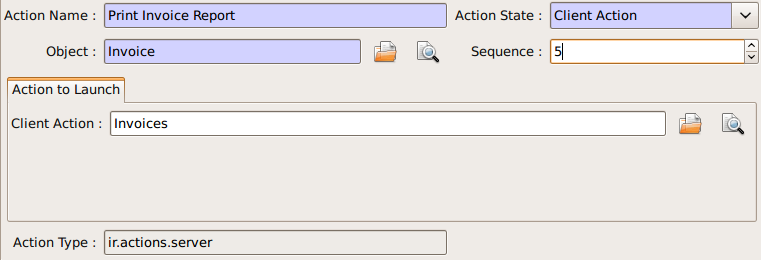
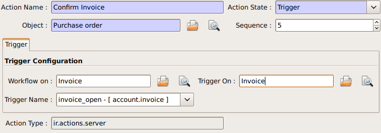
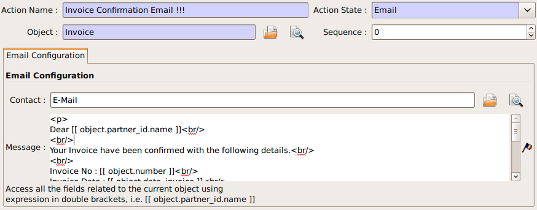
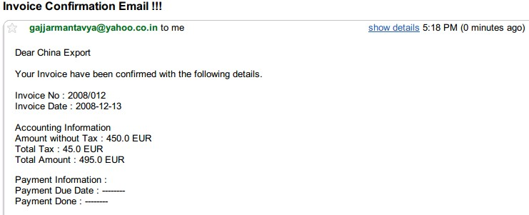
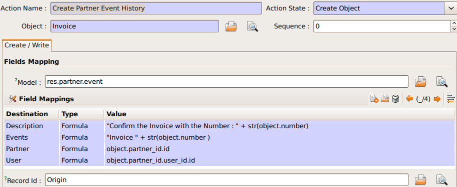
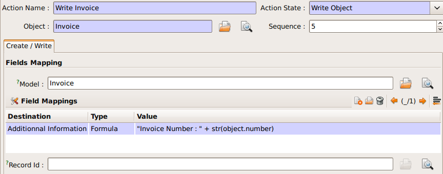
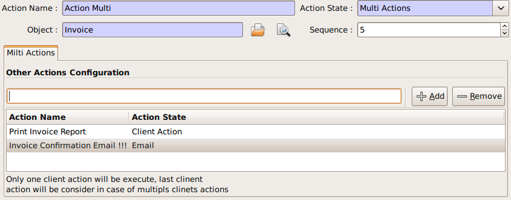
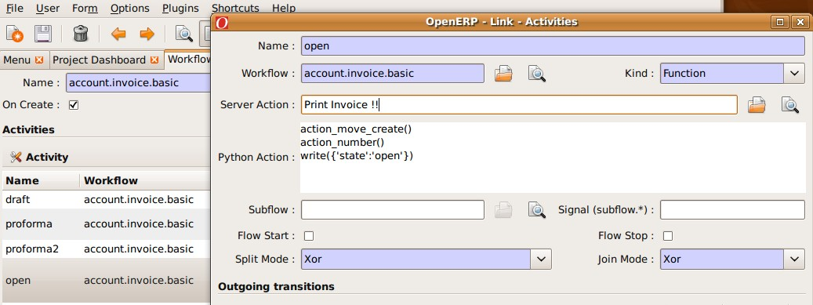

Server Action
=============

Introduction
------------

Server action is an new feature available since the OpenERP version 5.0 beta. This is an useful feature to fulfill customer requirements. It provides a quick and easy configuration for day to day requirements such as sending emails on confirmation of sale orders or invoice, logging operations on invoices (confirm, cancel, etc.), or running wizard/report on confirmation of sales, purchases, or invoices.

Step 1: Definition of Server Action
-----------------------------------

Here is the list of the different action types supplied under the Server Action.

-   Client Action
-   Dummy
-   Iteration
-   Python Code
-   Trigger
-   Email
-   SMS
-   Create Object
-   Write Object
-   Multi Action

Each type of action has special features and different configuration parameters. The following sections review each action type and describe how to configure them, together with a list of parameters affecting the system.

### Client Action

This action executes on the client side. It can be used to run a wizard or report on the client side. For example, a Client Action can print an invoice after it has been confirmed and run the payment wizard. Technically we can run any client action executed on client side. This includes ir.actions.report.custom, ir.actions.report.xml, ir.actions.act\_window, ir.actions.wizard, and ir.actions.url. In the following example, we can configure a Client Action to print the invoice after it has been confirmed.

Important fields are:

Object:   the object affected by the workflow on for which we want to run the action

Client Action:   the client action, which will be executed on the client side. It must have one of the following types:

-   ir.actions.report.custom
-   ir.actions.report.xml
-   ir.actions.act\_window
-   ir.actions.wizard
-   ir.actions.url

### Iteration

Using a Python loop expression, it is possible to iterate over a server action. For example, when confirming a inward stock move, each line item must be historized. You can loop on expression object.move\_lines and create another server action which is referred to do the historizing job.

### Python Code

This action type is used to execute multiline python code. The returned value is the value of the variable `action`, defaulting to `{}`. This makes sense only if you want to pop a specific window(form) specific to the context, but a return value is generally not needed.

Note: The code is executed using Python's `exec` built-in function. This function is run in a dedicated namespace containing the following identifiers: `object`, `time`, `cr`, `uid`, `ids`.

### Trigger

Any transition of the workflow can be triggered using this action. The options you need to set are:

Object:   the object affected by the workflow on for which we want to run the action

Workflow on:   The target object on which you want to trigger the workflow.

Trigger on:   the ID of the target model record, e.g. Invoice if you want to trigger a change on an invoice.

Trigger Name:   the signal you have to use to initiate the transition. The drop down lists all possible triggers. Note: the list contains all possible transitions from other models also, so ensure you select the right trigger. Models are shown in brackets.

The following example shows the configuration of a trigger used to automatically confirm invoices:

### Email Action

This action fulfills a common requirement for all business process, sending a confirmation by email whenever sales order, purchase order, invoice, payment or shipping of goods takes place.

Using this action does not require a dedicated email server: any existing SMTP email server and account can be used, including free email account (Gmail, Yahoo !, etc...)

*Server Configuration*

The OpenERP server must know how to connect to the SMTP server. This can be done from the command line when starting the server or by editing the configuration file. Here are the command line options:

    --email-from=<sender_email@address>
    --smtp=<smtp server name or IP address>
    --smtp-port=<smtp server port>
    --smtp-user=<smtp user name, if required>
    --smtp-password=<smtp user password, if required>
    --smtp-ssl=<true if the server requires SSL for sending email, else false>

Here is an example configuration an action which sends an email when an invoice is confirmed

Important Fields are:

Object:   the object affected by the workflow on for which we want to run the action

Contact:   the field from which action will find the email address of the recipient of the email. The system will displays all the fields related to the object selected in the Object field.

Message:   the message template with the fields that will filled using the current object. The notation is the same as the one used RML to design reports: you can use the \[\[ \]\] + HTML tags to design in the HTML format. For example to get the partner name we can use \[\[ object.partner\_id.name \]\], object refers to the current object and we can access any fields which exist in the model.

After configuring this action, whenever an invoice is confirmed, an email such as the following is sent:

### Create Object

This type of action can be used to emulate the Event history feature currently available on Partners, which logs sales orders issued by a partner, on other objects which do not natively support this feature, such as invoices:

Create Object action configuration can be tricky, since it is currently necessary to remember the field names (or to check them out from the source code itself). There are plans to provide an expression builder inside OpenERP in the future, which will be useful to build complex expressions.

Important fields are:

Object:   the object affected by the workflow on for which we want to run the action

Model:   the target model for the object to be created. If empty, it refers to the current object and allows to select the fields from it. It is recommended to provide a model in all cases.

Fields Mapping:   Need to provide 3 values:

1.  *Destination*: any of the fields from the target model
2.  *Type*: the type of the mapping. Allowed values are `value` or `formula`
3.  *Value*: provide the value or expression the expression. The `object` refers to the current object.

*You must select the all required fields from the target model*

Record Id:   the field in which the id of the new record is stored. This is used to refer to the same object in future operations (see below)

### Write Object

The configuration is very similar to the Create Object actions. The following example writes 'Additional Information' on the same object

Important Fields are

**same as the Create Object**

### Multi Action

This action allows to execute multiple server actions on the same business operation. For instance, it can be used to print *and* send an email on confirmation of an invoice. This requires creating 3 server actions:

-   Print Invoice
-   Invoice Confirmation Email !!
-   Multi Action

There is a fundamental restriction on this action: it can execute many actions at the server side, but only one single client action. It is therefore not possible to print a report and execute a wizard at the same time.

Important Fields are:

Object:   the object affected by the workflow on for which we want to run the action

Other Actions:   the list of server action. Any number of actions can be selected, but beware of the restriction mentioned above: if you select more than one Client action, only the first will be executed.

Step 2: Mapping Server actions to workflows
-------------------------------------------

Server actions by themselves are useless, until a workflow stage is set up to trigger them.

Workflows can be accessed at: Administration &gt;&gt; Customization &gt;&gt; Workflow Definitions &gt;&gt; Workflows. Open the corresponding workflow, edit the stage at which the server action needs to be triggered. Then Select the server action in the box.

The following example shows how to associate the Print invoice action to the Open state of the Invoice workflow:

