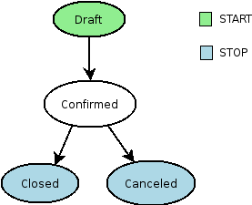
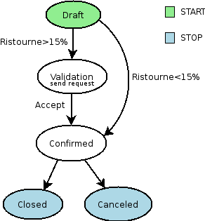
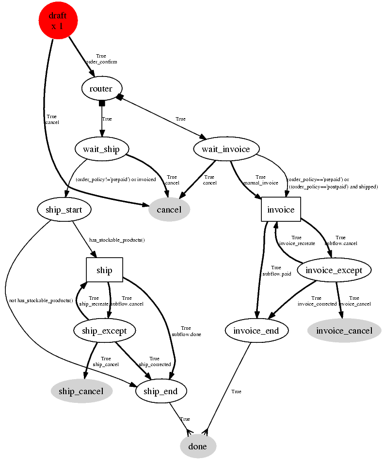
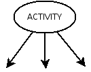

Workflow-Business Process
=========================

Introduction
------------

The workflow system in OpenERP is a very powerful mechanism that can describe the evolution of documents (model) in time.

Workflows are entirely customizable, they can be adapted to the flows and trade logic of almost any company. The workflow system makes OpenERP very flexible and allows it to easily support changing needs without having to program new functionality.

**Goals**

-   description of document evolution in time
-   automatic trigger of actions if some conditions are met
-   management of company roles and validation steps
-   management of interactions between the different objects/modules
-   graphical tool for visualization of document flows

**To understand their utility, see the following three:**

### Example 1: Discount On Orders

The first diagram represent a very basic workflow of an order:



The order starts in the 'draft' state, when it is being written and has not been approved yet. When the user presses on the 'Confirm' button, the invoice is created and the order transitions to the 'CONFIRMED' state.

Then, two operations are possible:

1.  the order is done (shipped)
2.  the order is canceled

Let's suppose a company has a need not implemented in OpenERP. For example, their sales staff can only offer discounts of 15% or less. Every order having a discount above 15% must be approved by the sales manager.

This modification in the sales logic doesn't need any lines of Python code! A simple modification of the workflow allows us to take this new need into account and add the extra validation step.



The workflow is modified as above and the orders will react as requested. We then only need to modify the order form view and add a validation button at the desired location.

We could then further improve this workflow by sending a request to the sales manager when an order enters the 'Validation' state. Workflow nodes can execute object methods; only two lines of Python are needed to send a request asking the sales manager to validate or reject the order.

### Example 2: A sale order that generates an invoice and a shipping order



### Example 3: Account invoice basic workflow


Defining Workflow
-----------------

Workflows are defined in the file `server/addons/base/ir/workflow/workflow.py`. The first three classes defined in this file are `workflow`, `wkf_activity` and `wkf_transition`. They correspond to the three types of resources necessary to describe a workflow:

-   [workflow](http://openobject.com/wiki/index.php/WkfDefXML) : the workflow,
-   [wkf\_activity](http://openobject.com/wiki/index.php/WorkflowActivity) : the activities (nodes),
-   [wkf\_transition](http://openobject.com/wiki/index.php/WorkflowTransition) : the transitions between the activities.

General structure of a workflow XML file
----------------------------------------

The general structure of a workflow XML file is as follows:

```xml
<?xml version="1.0"?>
<openerp>
<data>
<record model="workflow" id=workflow_id>

    <field name="name">workflow.name</field>
    <field name="osv">resource.model</field>
    <field name="on_create" eval='True|False' />

</record>

</data>
</openerp>
```

**Where**

-   **id** (here "workflow\_id") is a workflow identifier. Each workflow must have an unique identifier.
-   **name** (here "workflow.name") is the name of the workflow. The name of the workflow must respect the OpenERP syntax of "dotted names".
-   **osv** (here "resource.model") is the name of the object we use as a model \[-(Remember an OpenERP object inherits from osv.osv, hence the '&lt;field name="osv"&gt;')-\].
-   **on\_create** is True if workflow.name must be instantiated automatically when resource.model is created, and False otherwise.

**Example**

The workflow `sale.order.basic` defined in `addons/sale/sale_workflow.xml` follows exactly this model, the code of its workflow tag is:

```xml
<record model="workflow" id="wkf_sale">

    <field name="name">sale.order.basic</field>
    <field name="osv">sale.order</field>
    <field name="on_create" eval='True' />

</record>
```

Activity
--------

### Introduction

The `wkf_activity` class represents the nodes of workflows. These nodes are the actions to be executed.

### The fields

    split_mode



Possible values:

-   XOR: One necessary transition, takes the first one found (default).
-   OR: Take only valid transitions (0 or more) in sequential order.
-   AND: All valid transitions are launched at the same time (fork).

In the OR and AND separation mode, certain workitems can be generated.

In the AND mode, the activity waits for all transitions to be valid, even if some of them are already valid. They are all triggered at the same time.

    join_mode


Possible values:

-   **XOR**: One transition necessary to continue to the destination activity (default).
-   **AND**: Waits for all transition conditions to be valid to execute the destination activity.

<!-- -->

    kind

Possible values:

-   **dummy**: Do nothing (default).
-   **function**: Execute the function selected by an action.
-   **subflow**: Execute a sub-workflow SUBFLOW\_ID. The action method must return the ID of the concerned resource by the subflow. If the action returns False, the workitem disappears.
-   **stopall**:

A sub-workflow is executed when an activity is of the type SUBFLOW. This activity ends when the sub-workflow has finished. While the sub-workflow is active, the workitem of this activity is frozen.

    action

The action indicates the method to execute when a workitem comes into this activity. The method must be defined in an object which belongs to this workflow and have the following signature:

```python
def object_method(self, cr, uid, ids):
```

In the action though, they will be called by a statement like:

```python
object_method()
```

    signal_send

This field is used to specify a signal that will be sent to the parent workflow when the activity becomes active. To do this, set the value to the name of the signal (without the `signal.` prefix).

    flow_start

Indicates if the node is a start node. When a new instance of a workflow is created, a workitem is activated for each activity marked as a `flow_start`.

<div class="admonition warning">

As for all Boolean fields, when writing the `<field>` tag in your XML data, be sure to use the `eval` attribute and not a text node for this attribute. Read the section about the eval attribute &lt;eval-attribute-link&gt; for an explanation.

</div>

    flow_stop

Indicates if the node is an ending node. When all the active workitems for a given instance come in the node marked by flow\_stop, the workflow is finished.

<div class="admonition warning">

See above in the description of the `flow_start` field.

</div>

::

:   wkf\_id

The workflow this activity belongs to.

### Defining activities using XML files

The general structure of an activity record is as follows

```xml
<record model="workflow.activity" id="''activity_id''">
      <field name="wkf_id" ref="''workflow_id''"/>
      <field name="name">''activity.name''</field>::

      <field name="split_mode">XOR | OR | AND</field>
      <field name="join_mode">XOR | AND</field>
      <field name="kind">dummy | function | subflow | stopall</field>

      <field name="action">''(...)''</field>
      <field name="signal_send">''(...)''</field>
      <field name="flow_start" eval='True | False' />
      <field name="flow_stop" eval='True | False' />
  </record>
```

The first two arguments **wkf\_id** and name are mandatory.

### Examples

There are too many possibilities of activity definition to choose from using this definition. We recommend you to have a look at the file `server/addons/sale/sale_workflow.xml` for several examples of activity definitions.

Transition
----------

### Introduction

Workflow transitions are the conditions which need to be satisfied to move from one activity to the next. They are represented by one-way arrows joining two activities.

The conditions are of different types:

> -   role that the user must satisfy
> -   button pressed in the interface
> -   end of a subflow through a selected activity of subflow

The roles and signals are evaluated before the expression. If a role or a signal is false, the expression will not be evaluated.

Transition tests may not write values in objects.

### The fields

    act_from

Source activity. When this activity is over, the condition is tested to determine if we can start the ACT\_TO activity.

    act_to

The destination activity.

    condition

**Expression** to be satisfied if we want the transition done.

    signal

When the operation of transition comes from a button pressed in the client form, signal tests the name of the pressed button.

If signal is NULL, no button is necessary to validate this transition.

    role_id

The **role** that a user must have to validate this transition.

### Defining Transitions Using XML Files

The general structure of a transition record is as follows

```xml
<record model="workflow.transition" id="transition_id">

    <field name="act_from" ref="activity_id'_1_'"/>
    <field name="act_to" ref="activity_id'_2_'"/>

    <field name="signal">(...)</field>
    <field name="role_id" ref="role_id'_1_'"/>
    <field name="condition">(...)</field>

    <field name="trigger_model">(...)</field>
    <field name="trigger_expr_id">(...)</field>

</record>
```

Only the fields **act\_from** and **act\_to** are mandatory.

Expressions
-----------

Expressions are written as in Python:

-   True
-   1==1
-   'hello' in \['hello','bye'\]

Any field from the resource the workflow refers to can be used in these expressions. For example, if you were creating a workflow for partner addresses, you could use expressions like:

-   zip==1400
-   phone==mobile

User Role
---------

Roles can be attached to transitions. If a role is given for a transition, that transition can only be executed if the user who triggered it has the required role.

Each user can have one or several roles. Roles are defined in a tree of roles, parent roles having the rights of all their children.

Example:

CEO

-   Technical manager
    -   Lead developer
        -   Developers
        -   Testers
-   Sales manager
    -   Commercials
    -   ...

Let's suppose we handle our own bug database and that the action of marking a bug as valid needs the Testers role. In the example tree above, marking a bug as valid could be done by all the users having the following roles: Testers, Lead developer, Technical manager, CEO.

Error handling
--------------

As of this writing, there is no exception handling in workflows.

Workflows being made of several actions executed in batch, they can't trigger exceptions. In order to improve the execution efficiency and to release a maximum of locks, workflows commit at the end of each activity. This approach is reasonable because an activity is only started if the conditions of the transactions are satisfied.

The only problem comes from exceptions due to programming errors; in that case, only transactions belonging to the entirely completed activities are executed. Other transactions are "rolled back".

Creating a Workflow
-------------------

Steps for creating a simple state-changing workflow for a custom module called **mymod**

### Define the States of your object

The first step is to define the States your object can be in. We do this by adding a 'state' field to our object, in the \_columns collection

```python
_columns = {
 ...
    'state': fields.selection([
    ('new','New'),
    ('assigned','Assigned'),
    ('negotiation','Negotiation'),
    ('won','Won'),
    ('lost','Lost')], 'Stage', readonly=True),
}
```

### Define the State-change Handling Methods

Add the following additional methods to your object. These will be called by our workflow buttons.

```python
def mymod_new(self, cr, uid, ids):
     self.write(cr, uid, ids, {'state': 'new'})
     return True

def mymod_assigned(self, cr, uid, ids):
     self.write(cr, uid, ids, {'state': 'assigned'})
     return True

def mymod_negotiation(self, cr, uid, ids):
     self.write(cr, uid, ids, {'state': 'negotiation'})
     return True

def mymod_won(self, cr, uid, ids):
     self.write(cr, uid, ids, {'state': 'won'})
     return True

def mymod_lost(self, cr, uid, ids):
     self.write(cr, uid, ids, {'state': 'lost'})
     return True
```

Obviously you would extend these methods in the future to do something more useful!

### Create your Workflow XML file

There are three types of records we need to define in a file called `mymod_workflow.xml`

1.  Workflow header record (only one of these)

```xml
<record model="workflow" id="wkf_mymod">
    <field name="name">mymod.wkf</field>
    <field name="osv">mymod.mymod</field>
    <field name="on_create" eval='True' />
</record>
```

2.  Workflow Activity records

These define the actions that must be executed when the workflow reaches a particular state

```xml
<record model="workflow.activity" id="act_new">
    <field name="wkf_id" ref="wkf_mymod" />
    <field name="flow_start" eval='True' />
    <field name="name">new</field>
    <field name="kind">function</field>
    <field name="action">mymod_new()</field>
</record>

<record model="workflow.activity" id="act_assigned">
    <field name="wkf_id" ref="wkf_mymod" />
    <field name="name">assigned</field>
    <field name="kind">function</field>
    <field name="action">mymod_assigned()</field>
</record>

<record model="workflow.activity" id="act_negotiation">
    <field name="wkf_id" ref="wkf_mymod" />
    <field name="name">negotiation</field>
    <field name="kind">function</field>
    <field name="action">mymod_negotiation()</field>
</record>

<record model="workflow.activity" id="act_won">
    <field name="wkf_id" ref="wkf_mymod" />
    <field name="name">won</field>
    <field name="kind">function</field>
    <field name="action">mymod_won()</field>
    <field name="flow_stop" eval='True' />
</record>

<record model="workflow.activity" id="act_lost">
    <field name="wkf_id" ref="wkf_mymod" />
    <field name="name">lost</field>
    <field name="kind">function</field>
    <field name="action">mymod_lost()</field>
    <field name="flow_stop" eval='True' />
</record>
```

3.  Workflow Transition records

These define the possible transitions between workflow states

```xml
<record model="workflow.transition" id="t1">
    <field name="act_from" ref="act_new" />
    <field name="act_to" ref="act_assigned" />
    <field name="signal">mymod_assigned</field>
</record>

<record model="workflow.transition" id="t2">
    <field name="act_from" ref="act_assigned" />
    <field name="act_to" ref="act_negotiation" />
    <field name="signal">mymod_negotiation</field>
</record>

<record model="workflow.transition" id="t3">
    <field name="act_from" ref="act_negotiation" />
    <field name="act_to" ref="act_won" />
    <field name="signal">mymod_won</field>
</record>

<record model="workflow.transition" id="t4">
    <field name="act_from" ref="act_negotiation" />
    <field name="act_to" ref="act_lost" />
    <field name="signal">mymod_lost</field>
</record>
```

### Add mymod\_workflow.xml to \_\_openerp\_\_.py

Edit your module's `__openerp__.py` and add `"mymod_workflow.xml"` to the `update_xml` array, so that OpenERP picks it up next time your module is loaded.

### Add Workflow Buttons to your View

The final step is to add the required buttons to `mymod_views.xml` file.

Add the following at the end of the `<form>` section of your object's view definition:

```xml
<separator string="Workflow Actions" colspan="4"/>
<group colspan="4" col="3">
    <button name="mymod_assigned" string="Assigned" states="new" />
    <button name="mymod_negotiation" string="In Negotiation" states="assigned" />
    <button name="mymod_won" string="Won" states="negotiating" />
    <button name="mymod_lost" string="Lost" states="negotiating" />
</group>
```

### Testing

Now use the Module Manager to install or update your module. If you have done everything correctly you shouldn't get any errors. You can check if your workflow is installed in the menu Administration --&gt; Customization --&gt; Workflow Definitions.

When you are testing, remember that the workflow will only apply to NEW records that you create.

### Troubleshooting

If your buttons do not seem to be doing anything, one of the following two things are likely:

1.  The record you are working on does not have a Workflow Instance record associated with it (it was probably created before you defined your workflow)
2.  You have not set the `osv` field correctly in your workflow XML file

